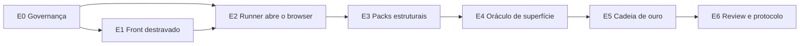

# Emenda 11 — Superfície de browser (kind `D`, fases `A5` e `A6`)

> **Status: APLICADA em 15/09/2026.** O diff da seção 3 foi aplicado a `docs/nokr-qa.md` (`A.19` novo, Fases 11–12, Ordem e PRs, e as sete edições de A.2 a A.18). Três ajustes foram feitos na aplicação, além do diff original: (1) a linha do **A.19 no Índice**, (2) o **cabeçalho de Status** (L3), e (3) a **âncora do índice** — como o cabeçalho literal carrega o parêntese, a âncora do GitHub é `#a19-superfície-de-browser-kind-d-fases-a5-e-a6`, não `#a19-superfície-de-browser`. Sem os três o A.19 ficaria fora do índice, o Status continuaria mentindo e o link não resolveria. A seção 7 (fases de execução `E0`–`E6`) continua válida como plano das etapas; `E0` está concluída.

---

## 0. Por que esta emenda existe

A spec atual declara o dashboard Angular como **não-objetivo** (A.2, "Não entra"; A.9 regra 9; `campaigns/trilho-a-http.yaml` em `exclude:`). A escolha foi consciente e continua correta para o que a Parte A entrega: contrato HTTP, packs, oráculo de dinheiro.

O que ela **não** responde é a pergunta que fecha o produto: *o número que o cliente vê na tela é o número que a API respondeu e que o ledger gravou?*

Hoje a conferência cruzada (A.18) para no JSON. Um `GET /platform/dashboard/metrics` devolvendo `gross_volume` correto **não prova** que o Overview renderiza aquele valor — prova só que o backend sabe calculá-lo. Entre o JSON e o pixel existem: mapeamento de campo, formatação, filtro de período, estado de erro engolido, `signal` que não atualizou, guard de ambiente. Nenhum desses é coberto por um GET.

Esta emenda adiciona **uma origem de leitura a mais** ao modelo de `probe` que já existe. Não é uma suíte nova, não é um segundo runner, não é um serviço externo.

## 1. Escopo

**Entra:**

- Navegador real (Chromium) dirigido pelo runner, com o mesmo `trace_id` dos passos HTTP.
- **Cinco telas de dinheiro**, escolhidas por serem as que exibem valor conferível contra a API: `/overview`, `/customers` (`tab=ledger` e `tab=metrics`), `/financial` (`tab=overview`), `/catalog` (`tab=rate-cards`), `/keys` (`tab=credentials`).
- Leitura de valor renderizado como **superfície de oráculo**, comparável ao `book.json`.
- Estrutura (ARIA snapshot), acessibilidade WCAG A/AA e ausência de erro de console como packs.
- Um passo `ui` na suite, que se mistura com `loop` e `probe` no mesmo run.
- Campanha **Trilho C — Superfície**, com as seções `A5` (observação de dashboard) e `A6` (chrome).

**Continua fora:**

- Os outros 11 routes, as abas não listadas, e os dois pages órfãos (`agents`, `security`) que não são roteados.
- Firefox e WebKit. Chromium é o alvo; cross-browser só se um bug real aparecer.
- Regressão visual por pixel como gate. O ARIA snapshot é o gate estrutural; `toHaveScreenshot` entra como pack **waivável por default** no v1.
- Substituir o Vitest do `nokr-ui-lib`. Ele continua o nível de componente.
- OpenTelemetry e asserção sobre spans. Ver 2.4.
- Cartesiano de estados de UI. Cobertura é por tela × estado principal, não por combinação.

## 2. Decisões travadas

### 2.1 Playwright no SDK Python, dentro do runner

A alternativa era uma suíte Playwright em TypeScript no `nokr-ui-lib`. Rejeitada: criaria a segunda fonte de verdade que este harness existe para evitar, e o `trace_id`, o `verdict.json` e o `book.json` teriam de ser reimplementados lá.

O SDK Python do Playwright expõe `to_match_aria_snapshot`, `to_have_screenshot`, `expect_response` e o trace viewer. Não há perda de capacidade por ficar em Python.

Consequência operacional: o dashboard precisa estar no ar em `http://localhost:4200` além da API em `8080`. Entra em `config.yaml` como `nokr_dashboard`, com preflight que falha o round (não SKIP) se a porta não responder.

### 2.2 ARIA snapshot é o gate; pixel não é

O app não tem um único `data-testid` e os rótulos são PT-BR via `I18nService`. Snapshot de DOM quebraria a cada ajuste de CSS; seletor por texto quebraria a cada ajuste de copy. O ARIA snapshot é a árvore que o leitor de tela consome: sobrevive a refactor visual, é legível em diff e cobre nomes e papéis acessíveis de graça.

Regra de convivência: **âncora de teste é o último recurso**. Onde houver papel acessível com nome próprio (`getByRole('button', { name: ... })`), usa-se isso. `data-testid` entra só onde não existe semântica (células de KPI em grid). Ver Fase 0 do plano.

### 2.3 O `trace_id` do harness vale para o browser

O passo `ui` seta `extraHTTPHeaders: {"X-Trace-Id": "nokrqa-<run>-<step>"}` no contexto do browser. Toda chamada que a tela fizer para `/platform/**` carrega o mesmo id, `MdcLoggingFilter` devolve no header, e `logs/collector.py` acha as linhas normalmente.

Isso significa que os packs `observability` e `http.success` — já existentes, já endurecidos — passam a valer para o tráfego do browser **sem uma linha de mudança neles**. É a razão principal de o browser morar neste harness.

### 2.4 Sem OpenTelemetry agora

A NokrAPI tem Actuator e Micrometer, mas nenhuma instrumentação OTel. O `trace_id` de hoje é MDC + log, e já atravessa web → Rabbit → worker. Tracetest e asserção sobre spans exigiriam instrumentar a JVM, propagar `traceparent` no header AMQP e subir um collector — projeto próprio, com ganho incremental sobre o que a correlação por log já entrega. Fica fora desta emenda e é registrado como P-GAP se alguém quiser reabrir.

### 2.5 Uma suíte só

A suíte E2E vive em `nokr-qa`. O `nokr-ui-lib` recebe apenas o que é pré-requisito de testabilidade (âncoras, `BASE_URL` configurável, CI mínimo). Nenhum teste de browser no repo do front.

## 3. Edições literais em `docs/nokr-qa.md`

### 3.1 A.2 Recorte — "Não entra"

Remover a linha:

```text
- Dashboard Angular (`nokr-b2b-dashboard`, kind **D**, chrome A6).
```

Substituir por, dentro de "Entra no produto":

```text
- Superfície de browser (kind **D**, fases `A5` e `A6`): cinco telas de dinheiro do `nokr-b2b-dashboard` em Chromium, dirigidas pelo runner com o mesmo `trace_id` dos passos HTTP, para conferir o valor **renderizado** contra a API e o `book.json` (A.19).
```

### 3.2 A.6 Camadas YAML — passo `ui`

No item 6 da ordem de dependência, onde hoje se lê `Loop + probe`, passa a ser:

```text
6. **Loop, probe e ui** — não são cases H/O/B/N. `loop` dispara o mesmo case N vezes com `generate:` novo a cada iteração. `probe` tira foto antes/depois, aplica o oráculo e compara GETs de conferência. `ui` abre uma tela no Chromium, lê valores e roda os packs de superfície. Schema de `loop` e `probe` em A.18; de `ui` em A.19.
```

### 3.3 A.9 Regras de escrita — regra 9

Substituir:

```text
9. **D (dashboard)** — fora do harness HTTP. Kind D não é gerado.
```

por:

```text
9. **D (dashboard)** — não é gerado por `scaffold-endpoint`: o kind D não tem contrato de DTO. Rounds de superfície se declaram como passo `ui` na suite, com `matrix: A5` ou `A6` (A.19).
```

### 3.4 A.12 Interface (browser)

Acrescentar ao final da seção:

```text
Passo `ui`: mostra, por tela, o **ARIA snapshot** lido, o valor capturado de cada `surface` **esperado vs lido**, violações do axe com o nó apontado, e erros de console com a stack. Screenshot aparece quando o pack `ui.visual` não estiver waivado. Sem exibir JWT nem `nk_test_` (mesma regra de redact de A.13).
```

### 3.5 A.13 Artefatos de um run

Acrescentar ao bloco de layout:

```text
  steps/007-ui-overview/          # passo ui (A.19)
    ui.json                       # navegação: url, tela, estado, duração
    aria.yml                      # snapshot estrutural da região lida
    ui-values.json                # surface -> valor renderizado
    console.log                   # erro/warn do browser
    network.json                  # requests observadas, com trace_id
    screenshot.png                # só se ui.visual não estiver waivado
```

### 3.6 A.15 KPIs

Acrescentar à lista:

```text
- Falhas de `ui.value` (tela divergente da API) — alvo 0, e **nunca** waivável sem P-GAP.
- Violações WCAG A/AA por tela — alvo 0 nas telas de escopo.
- Erros de console por passo `ui` — alvo 0.
```

### 3.7 A.18 Validação cruzada — origem da superfície

Onde hoje se lê `GET` e `jsonpath` nas `surfaces`, passa a valer `from: api | ui`:

```yaml
      surfaces:
        - id: overview_kpi
          from: ui
          ui:
            path: /overview
            read: "$.revenue.gross_volume"     # mesmo campo do DTO, lido na tela
          expect: increase
          timeout_ms: 30000
```

`from` é opcional e default `api`, preservando toda suite existente. `timeout_ms` reusa a política de A.18 (wait-then-**fail**, nunca SKIP).

### 3.8 Novo A.19

Inserir após A.18:

````markdown
## A.19 Superfície de browser (kind D, fases A5 e A6)

**Objetivo:** provar que o valor que o cliente vê é o valor que a API respondeu e o ledger gravou. O GET prova o backend; só a tela prova a tela.

### Escopo

Cinco telas, escolhidas por exibirem valor conferível: `/overview`, `/customers?tab=ledger`, `/customers?tab=metrics`, `/financial?tab=overview`, `/catalog?tab=rate-cards`, `/keys?tab=credentials`. Chromium. O resto do app não entra.

### Contrato de execução

1. `ui` abre a tela no Chromium com `extraHTTPHeaders: X-Trace-Id: nokrqa-<run>-<step>`.
2. Espera a hidratação e o carregamento dos dados (`wait_for_response` do endpoint que alimenta a tela — nunca `sleep`).
3. Roda os packs na ordem: `ui.render`, `ui.structure`, `ui.a11y`.
4. Se a suite declara `capture_ui`, lê os campos para `captures` (chave de API view-once, ids criados na tela).
5. Grava os artefatos de A.13.
6. Se a tela é superfície de um `probe`, o valor lido entra em `ui-values.json` e o oráculo compara como qualquer `surface` de A.18.

Auth: o JWT do dashboard vive **só em memória** (`AuthService._session`), então `storageState` não serve. O passo dirige o formulário com `secret.email` / `secret.password`. Ambiente (`sandbox` | `production`) vem de `localStorage['nokr_selected_environment']`, setado antes do `goto`.

### Packs

| Pack | Dá fail quando | Fonte |
|---|---|---|
| `ui.render` | Erro no console, ou request observada com 5xx durante a navegação | `console.log`, `network.json` |
| `ui.structure` | Árvore ARIA diverge do `aria.yml` commitado | `aria.yml` |
| `ui.a11y` | Violação WCAG A/AA no estado da tela | axe-core |
| `ui.value` | Valor renderizado difere do esperado pelo oráculo | `ui-values.json` vs `book.json` |
| `ui.visual` | Diff de pixel acima da tolerância | `screenshot.png` (waivável no v1) |

`ui.value` é o pack que justifica a emenda. Ele **não** é waivável sem P-GAP registrado.

### Falso verde

Os services do dashboard engolem erro e devolvem zero ou lista vazia (`dashboard.service.ts` retorna `generateEmptyMetrics()` em 404; `customers`, `financial` e `company` fazem o mesmo). **Tela sem erro não é evidência.** O oráculo lê o número renderizado e compara com a fonte; ausência de exceção não entra no veredito.

O dashboard é **CSR puro**: não existe HTML de prerender. Os `authGuard` e `guestGuard` avaliam a sessão no cliente, e a sessão vive só em memória (ver `AuthService`). Toda leitura acontece depois do boot do app, nunca sobre um HTML vindo do servidor.

### Cadeia de superfície (fase A5)

O caso completo, num run só, com um `trace_id`:

```yaml
# suites/trilho-c-cadeia.yaml
id: trilho-c-cadeia
steps:
  - ui:  { id: login,      path: /auth/login }
  - ui:  { id: cria-metrica, path: /catalog, capture_ui: { metric_id: "$.created.id" } }
  - ui:  { id: cria-chave,   path: /keys,    capture_ui: { api_key: "$.view_once_key" } }
  - loop:
      times: 7
      case: cases/ingest/ingest-H01.yaml
      generate: { transaction_id: uuid, idempotency_key: uuid_v4 }
      after_each:
        poll: { get: /api/ingest/{{transaction_id}}, until_jsonpath: $.quantities[0].rating.status, until_not: PENDING }
  - probe:
      id: cadeia-ui
      oracle: { ingest: flat_session }
      surfaces:
        - { id: overview_ui,      from: ui, ui: { path: /overview,              read: "$.conversion.test_drive_consumed_percent" }, expect: increase }
        - { id: customer_ui,      from: ui, ui: { path: /customers?tab=ledger,  read: "$.content[0].balance" }, expect: exact }
        - { id: overview_api,     from: api, get: /platform/dashboard/metrics,  jsonpath: "$.conversion.test_drive_consumed_percent", expect: increase }
```

`ui.value` compara `overview_ui` com `overview_api` e com o oráculo. Divergência entre tela e API é **falha de produto**, não de instrumento.

### Fase A6 (chrome)

Round separado, sem oráculo de dinheiro: os cinco paths, `ui.structure` + `ui.a11y` + `ui.render`. É o round que pega regressão de layout, nome acessível perdido e erro de console introduzido por refactor.

### Timeout, retry, fail

| Superfície | Default | Esgotou |
|---|---|---|
| Carregamento da tela | `ui.page_ms` (15000) | **FALHOU** o passo (não SKIP) |
| Leitura de valor (`from: ui`) | `probes.overview_ms` (30000) | **FALHOU** `values.consistency` |

### Não entra

- Navegar por clique cego em toda a UI. O caminho é declarado no YAML.
- Asserção sobre pixel como gate.
- Dirigir o dashboard pela porta `7878`. O agente continua proibido (A.14).
- Trocar o Vitest do `nokr-ui-lib`.
````

### 3.9 Parte B — duas fases

**Fase 11 — Superfície de browser (runner).** Bloco `ui:` em `CaseFile` e tipo de passo `ui` em `SuiteStep`; dependência `playwright` (SDK Python) e browser Chromium instalado no setup; execução no `runner.execute_step`; artefatos de A.13; `nokr_dashboard` em `config.yaml` com preflight; `MatrixSection` ganha `A5` e `A6`; `CampaignExclude` default deixa de excluí-las no Trilho C.

*Aceite:* um round que faz login no dashboard e abre `/overview`; `ui.json`, `aria.yml` e `console.log` gravados; `observability` e `http.success` verdes nas chamadas que o **browser** fez; dashboard fora do ar → falha dura, não SKIP.

**Fase 12 — Oráculo de superfície.** `from: ui` em `SurfaceSpec`; `capture_ui`; packs `ui.render`, `ui.structure`, `ui.a11y`, `ui.value` (e `ui.visual` waivável); painel de UI no `serve`; campanha `campaigns/trilho-c-ui.yaml`; `ui.page_ms` em `config.yaml`.

*Aceite:* a cadeia de A.19 roda ponta a ponta; `ui.value` falha quando o valor da tela é divergido de propósito (fixture com a tela mentindo); zero violação A/AA nas cinco telas; `analysis.md` com seção de superfície.

**Pré-requisito (repo `nokr-ui-lib`, PR próprio):** âncoras de teste nos elementos interativos das cinco telas, `BASE_URL` configurável (hoje hardcoded e duplicado em 9 services), e CI mínimo (`nx affected -t lint test build`). Sem isso a Fase 11 não tem onde se apoiar — e hoje **nada** roda em PR no front.

### 3.10 Ordem e PRs

Acrescentar ao quadro:

| Fase | PR típico | Repo |
|---|---|---|
| pré | âncoras + `BASE_URL` + CI | nokr-ui-lib |
| 11 | passo `ui` + Playwright + artefatos | nokr-qa |
| 12 | `from: ui` + packs + Trilho C | nokr-qa |

E acrescentar à regra de encerramento: "Depois da Fase 12, novas demandas de superfície = novo round no Trilho C."

## 4. Impacto no código atual

| Ponto | Arquivo | Mudança |
|---|---|---|
| Execução | `runner.execute_step` (`runner.py:125`) | Um passo a mais; o contrato a jusante (pasta com artefatos) não muda |
| Modo | gate em `runner.py:884-891` | Passo `ui` não executa em modo `headless` se `nokr_dashboard` não responder |
| Schema | `CaseFile`, `SuiteStep` (`schema/models.py`) | `extra="ignore"` engole o bloco `ui:` em silêncio hoje — o validator de `SuiteStep` (linhas 235-248) precisa aceitá-lo |
| Artefatos | `run_store.write_step` | Nova pasta `ui/` |
| Packs | `packs/__init__.py:58-101` | `PackContext` ganha os campos de UI; `run_all` ganha os packs condicionais |
| Oráculo | `suite_run._get_surface` (`suite_run.py:460-469`) | Ramo `from: ui` |
| Correlação | `logs/collector.py:31-54` | **Sem mudança** — é o ponto |
| UI humana | `serve/app.py:_pane_extra` (165-182) | Ramo do passo `ui` |
| Governança | `docs/nokr-qa.md`, `campaigns/trilho-a-http.yaml:10`, `.cursor/skills/nokr-qa-round/SKILL.md` | Esta emenda |

## 5. Aceite da emenda

1. `docs/nokr-qa.md` aplica as edições da seção 3 sem contradição interna (`validate` não pode recusar o que A.19 permite).
2. `campaigns/trilho-a-http.yaml` mantém `A5` e `A6` em `exclude:` — a campanha HTTP não muda de comportamento.
3. Skill (`nokr-qa-round`) ganha o pedido "cubra a superfície do dashboard" apontando A.19.
4. Nenhuma dependência nova de serviço externo. Chromium é instalado local, como o `playwright install chromium` do próprio pacote.
5. `secrets.local.yaml` continua gitignored; nenhum JWT ou `nk_test_` em artefato (redact de A.13 vale para `ui/*`).

## 6. Riscos aceitos

| Risco | Mitigação |
|---|---|
| Flake por timing de hidratação | Esperar `wait_for_response` do endpoint da tela, nunca `sleep` |
| Flake visual | `ui.visual` waivável no v1; Chromium só |
| Custo de manutenção do `aria.yml` | Snapshot por região, não por `body`; atualização é ação local revisada em PR, nunca `--update` no CI |
| Dados de sessão compartilhados entre passos | `capture_ui` alimenta `captures`, reusando o mecanismo existente |
| Dois repos com Playwright | Proibido por 2.5: só `nokr-qa` tem browser |

---

## 7. Fases de execução

> Esta seção **traduz os requisitos acima em ordem de execução**. Ela não substitui §3.9: aquela define o que entra na Parte B da spec (duas fases, `11` e `12`); esta decompõe o trabalho real do repositório. O mapeamento entre os dois vocabulários está em §7.11.

Os identificadores `E0`–`E6` são usados aqui para não colidir com a numeração `11`/`12` da spec nem com a numeração do plano de execução. Cada etapa é **um PR**, com um gate verificável. Todas as etapas exceto `E1` acontecem no repo `nokr-qa`.

### 7.1 Grafo de dependências



`E0` é pré-requisito de tudo: sem a emenda aplicada, o código que a implementa nasce fora de contrato (§40 da constituição). `E1` e `E2` podem correr em paralelo na primeira metade, mas o gate de `E2` precisa das âncoras — por isso `E1 → E2`. `E3` só faz sentido depois de `E2`: um pack estrutural sobre um passo que ainda não abre browser não tem o que avaliar.

### 7.2 Domínio de cada etapa

| Etapa | Domínio | Rotulável como |
|---|---|---|
| `E0` | Governança e destravamento do contrato | `governance`, `qa` |
| `E1` | Front testável (repo `nokr-ui-lib`) | `ui-lib`, `testability` |
| `E2` | Motor: o browser entra no runner | `qa`, `runner` |
| `E3` | Verificação estrutural | `qa`, `packs` |
| `E4` | Verificação de valor (o pack que justifica a emenda) | `qa`, `oracle` |
| `E5` | Conteúdo: a cadeia de ouro e a campanha | `qa`, `content` |
| `E6` | Review humano e protocolo do agente | `qa`, `docs` |

---

### 7.3 E0 — Governança e destravamento do contrato

**Objetivo.** A emenda deixa de ser proposta e passa a spec vigente. O harness passa a *aceitar declarativamente* um passo que ainda não executa, sem quebrar nada do que já roda.

**Requisitos cobertos.** `R1`–`R8` (edições literais em `docs/nokr-qa.md`; novo A.19; Fases 11/12 na Parte B; `from` com default `api`; Trilho A intocado; skill atualizado; nenhuma dependência de serviço externo; redact estendido a `ui/`).

**Arquivos.** `docs/nokr-qa.md` (§3.1–§3.10), `campaigns/trilho-a-http.yaml` (verificar, não alterar), `.cursor/skills/nokr-qa-round/SKILL.md`, `.agents/skills/nokr-qa-round/SKILL.md`, `AGENTS.md`, `README.md`.

**Entregável.** Spec aplicada; skill com o pedido novo apontando A.19; `secrets.local.yaml` confirmado no `.gitignore`.

**Gate.**

1. `./bin/nokr-qa campaign validate campaigns/trilho-a-http.yaml` continua verde e **nenhum** round do Trilho A muda de status.
2. `git diff campaigns/trilho-a-http.yaml` vazio — a campanha HTTP não mudou de comportamento (§5.2).
3. Revisão humana do diff da spec: nenhuma contradição interna (`validate` não pode recusar o que A.19 permite). Este é o único gate não automatizável da emenda.

**Não fazer.** Reescrever A.18; mexer no comportamento do Trilho A; aplicar a emenda e implementar o runner no mesmo PR.

---

### 7.4 E1 — Front destravado (`nokr-ui-lib`)

**Objetivo.** Tornar as cinco telas de dinheiro dirigíveis por um browser externo sem depender de copy em português.

**Requisitos cobertos.** `R9`–`R11` (âncoras acessíveis; `BASE_URL` configurável; CI mínimo).

**Arquivos.** `apps/nokr-b2b-dashboard/src/app/pages/{overview,customers,financial,catalog,api-keys}/**`; os nove services que duplicam o `const BASE_URL` (`auth`, `dashboard`, `customers`, `catalog`, `entitlements`, `financial`, `api-keys`, `webhook`, `company`); `nx.json`/`project.json` e o workflow de CI.

**Entregável.** Cada valor conferível das cinco telas exposto por âncora estável; `BASE_URL` definido num só lugar; `lint`, `test` e `build` rodando em PR.

**Gate.**

1. Um teste de fumaça abre as cinco telas e localiza os valores conferíveis **sem** casar texto — só por papel acessível com nome, ou por `data-testid` onde não existe semântica (§2.2).
2. `pnpm exec nx affected -t lint test build` verde num PR de verdade (não só local).
3. Build de produção aponta `https://api.nokr.com` sem edição de código.

**Não fazer.** Ler variável de ambiente de processo no browser (o valor precisa chegar ao bundle); substituir âncora por texto PT-BR; mexer em layout, design tokens ou copy.

**Observação.** Esta etapa é o gargalo real: hoje o front não tem **nenhum** `data-testid`, tem o `BASE_URL` duplicado em nove services e **não tem CI** (`.github/` não existe). Enquanto ela não fechar, `E2` não tem onde se apoiar.

---

### 7.5 E2 — O runner abre o browser

**Objetivo.** Produzir evidência de tela no mesmo run dos passos HTTP, sob o mesmo `trace_id`.

**Requisitos cobertos.** `R12`–`R22` (bloco `ui:`; passo `ui`; `validate` aceita; Playwright + Chromium; execução em `runner.execute_step`; `nokr_dashboard` com preflight; falha dura; artefatos; `trace_id` no browser; espera por hidratação; auth por formulário).

**Arquivos.** `src/nokr_qa/schema/models.py` (`CaseFile`, `SuiteStep` — atenção: ambos usam `extra="ignore"`, então um bloco `ui:` inválido passaria em silêncio); `src/nokr_qa/runner.py` (`execute_step` em 125, gate de modo em 884-891); `src/nokr_qa/run_store.py` (`write_step`); `src/nokr_qa/config.py` e `config.yaml`; `pyproject.toml`; `tests/`.

**Entregável.** Um round que faz login e abre `/overview`, gravando `steps/NNN/ui/{ui.json, aria.yml, ui-values.json, console.log, network.json}` (e `screenshot.png` só quando `ui.visual` não estiver waivado).

**Gate.**

1. Os artefatos existem e são não vazios para o passo.
2. As chamadas que o **browser** fez aparecem em `logs-web.txt` filtradas pelo **mesmo** `trace_id`, e os packs `observability` e `http.success` passam nelas — **sem uma linha de mudança nesses packs** (§2.3).
3. Dashboard fora do ar → o passo falha com causa de **instrumento**, não SKIP e não `pass`.
4. `nokr-qa validate` aceita o passo novo e a expansão de kinds do contract segue inalterada.
5. Testes herméticos de schema, `validate` e artefato verdes; o teste de browser roda marcado `slow` (local, sem CI obrigatório).

**Não fazer.** Abrir browser no profile `worker`; usar `sleep` em qualquer ponto; subir o dashboard sem preflight; deixar `extra="ignore"` engolir o bloco `ui:`; ler valor antes da hidratação (os guards retornam `true` no server — §3.8).

---

### 7.6 E3 — Packs estruturais

**Objetivo.** Transformar estrutura, acessibilidade e console em veredito automático.

**Requisitos cobertos.** `R23`–`R27` (`ui.render`, `ui.structure`, `ui.a11y`; `PackContext` estendido; `ui.visual` waivável).

**Arquivos.** `src/nokr_qa/packs/__init__.py` (`PackContext` em 58-83, `run_all` em 85-101 — a lista é fixa, não há registry); `src/nokr_qa/run_store.py`; `tests/test_packs.py`.

**Entregável.** Os três packs entrando no `run_all` de forma condicional ao `kind` do passo.

**Gate.** Três fixtures plantadas, cada uma fazendo **um** pack falhar:

1. Erro de console → `ui.render` falha.
2. Árvore ARIA divergente do `aria.yml` commitado → `ui.structure` falha.
3. Violação WCAG A/AA conhecida → `ui.a11y` falha.

E `ui.visual` waivável sem P-GAP é aceito; `ui.value` **não** é (verificável só em `E4`).

**Não fazer.** Snapshot de `body` inteiro (usar recorte por região); `--update` de snapshot no CI; tornar `ui.structure` sensível a mudança de CSS.

---

### 7.7 E4 — Oráculo de superfície

**Objetivo.** Fechar a pergunta que justifica a emenda: a tela mostra o que a API respondeu e o ledger gravou?

**Requisitos cobertos.** `R28`–`R33` e `R37` (`from: api|ui`; ramo em `_get_surface`/`_wait_surface`; `ui.value` não waivável; `capture_ui`; falso verde; timeouts que falham; fixture de divergência).

**Arquivos.** `src/nokr_qa/schema/models.py` (`SurfaceSpec`); `src/nokr_qa/suite_run.py` (`_get_surface` em 460-469, `_wait_surface` em 409-427); `src/nokr_qa/packs/__init__.py`; `src/nokr_qa/oracle/book.py`; `tests/test_values_packs.py`.

**Entregável.** `from: ui` lendo valor renderizado, `capture_ui` alimentando `captures`, e o pack `ui.value` comparando tela × API × `book.json`.

**Gate.**

1. **Fixture A — a tela mente:** valor renderizado divergindo do oráculo → `ui.value` **falha**.
2. **Fixture B — tela verde, API quebrada:** o service engole o erro e devolve zero (padrão de `dashboard.service.ts` em 404) → **falha** também. Ausência de exceção **não** é prova (§3.8).
3. `capture_ui` guarda a chave view-once e um passo HTTP **seguinte** a usa por `{{api_key}}`.
4. `from: ui` sem bater no timeout → `values.consistency` **falha**; nunca SKIP.
5. Toda suite existente (incluindo `values-10m-7i`) continua verde sem edição — `from` default é `api`.

**Não fazer.** Tornar `ui.value` waivável sem P-GAP; aceitar "não deu erro" como veredito; declarar `from: ui` sem `timeout_ms`.

---

### 7.8 E5 — Cadeia de ouro e Trilho C

**Objetivo.** O pedido original — do consumo até a visualização no dashboard — executável por um comando.

**Requisitos cobertos.** `R34`–`R36` (suite da cadeia; rounds A5/A6; campanha `trilho-c-ui.yaml`; `MatrixSection` com `A5`/`A6`; `CampaignExclude`).

**Arquivos.** `suites/trilho-c-cadeia.yaml`; `rounds/`; `campaigns/trilho-c-ui.yaml`; `src/nokr_qa/schema/models.py` (`MatrixSection`).

**Entregável.** Um run que faz login → cria métrica e rate card pela tela → cria API key pela tela → `loop` de 7 ingest com a chave capturada → poll `PENDING` → `MATCHED` → `/overview` lê o KPI → `/customers` lê o saldo.

**Gate.**

1. A cadeia fecha `tela == API == book.json` na escala 5 (`HALF_EVEN`).
2. `./bin/nokr-qa campaign validate campaigns/trilho-c-ui.yaml` sem erro.
3. O round `A6` (chrome) roda sozinho com `ui.structure` + `ui.a11y` + `ui.render`, sem oráculo de dinheiro.
4. `campaigns/trilho-a-http.yaml` continua intocado.

**Não fazer.** Duplicar casos H do ingest em sete arquivos (é `loop`); usar `revenue.gross_volume` em lote PROMOTIONAL; tocar no Trilho A.

---

### 7.9 E6 — Review e protocolo do agente

**Objetivo.** O passo `ui` revisável por humano e analisável por agente, com o mesmo contrato de arquivos de A.14.

**Requisitos cobertos.** `R38`–`R41` (painel no `serve`; redact; skill/README; `analysis.md`; `ui.page_ms`).

**Arquivos.** `src/nokr_qa/serve/app.py` (`_pane_extra`, 165-182), um partial novo em `serve/templates/`, `src/nokr_qa/workspace.py` (`_pane`, 165-175), `config.yaml`, skill e `README.md`.

**Entregável.** Painel do passo `ui` mostrando ARIA lido, esperado vs lido por superfície, violações axe com o nó apontado e erros de console com stack, além do screenshot quando `ui.visual` não estiver waivado.

**Gate.**

1. O painel renderiza os quatro blocos a partir da pasta do run, sem reenviar HTTP.
2. **Nenhum** JWT, `nk_test_` ou `nk_live_` visível no painel nem gravado em `ui/` (redact de A.13, §5.5).
3. `analysis.md` tem seção de superfície; o skill descreve o fluxo sem o operador explicar o repo.
4. Testes de `serve` cobrem o ramo novo.

**Não fazer.** Fazer o agente chamar a porta `7878` (regra 6 da constituição do QA continua valendo); expor segredo no painel.

---

### 7.10 Definição de pronto (todas as etapas)

- Um PR por etapa; o aceite da anterior no corpo da seguinte.
- Todo gate é verificável por **comando** ou por **fixture plantada** — nenhum gate é "olhar e achar bonito".
- Nenhuma etapa adiciona dependência de serviço externo (§5.4). Chromium instala local.
- `secrets.local.yaml` continua gitignored e ausente de todo artefato e tela (§5.5).
- `logs/collector.py` não é modificado em etapa nenhuma. Se precisar ser, a premissa de §2.3 caiu e a emenda precisa voltar para revisão.

### 7.11 Mapeamento de rótulos

| Etapa (execução) | Fase na spec (§3.9) | Repo | Domínio |
|---|---|---|---|
| `E0` | — (é pré-requisito da Parte B) | `nokr-qa` | governança |
| `E1` | pré-requisito declarado em §3.9 | `nokr-ui-lib` | front testável |
| `E2` | Fase **11** | `nokr-qa` | motor + artefatos + trace |
| `E3` | Fase **12** (parte) | `nokr-qa` | packs `ui.render`, `ui.structure`, `ui.a11y` |
| `E4` | Fase **12** (parte) | `nokr-qa` | `from: ui` + `ui.value` + `capture_ui` |
| `E5` | Fase **12** (parte) | `nokr-qa` | cadeia de ouro + Trilho C |
| `E6` | Fase **12** (parte) | `nokr-qa` | review + protocolo |

A spec agrupa `E3`–`E6` numa fase só (`12`) porque, do ponto de vista do contrato, elas mudam a mesma camada. Na execução elas são separadas porque cada uma tem gate próprio e falha de forma independente — juntar faria um PR grande e um gate ambíguo.

### 7.12 Rastreabilidade dos requisitos

Cada linha da emenda tem etapa e gate. Nenhum requisito fica órfão.

| Requisito | Onde na emenda | Etapa | Gate |
|---|---|---|---|
| Edições literais na spec | §3.1–§3.8 | `E0` | spec sem contradição interna |
| Novo A.19 e Fases 11/12 na Parte B | §3.8, §3.9 | `E0` | revisão humana do diff |
| `from` com default `api`, retrocompatível | §3.7 | `E0` declara, `E4` implementa | suite `values-10m-7i` inalterada |
| Trilho A mantém `A5`/`A6` no `exclude` | §5.2 | `E0` | `git diff` do YAML vazio |
| Skill com o pedido de superfície | §5.3 | `E0` (texto), `E6` (fluxo) | revisão humana |
| Nenhuma dependência de serviço externo | §5.4 | todas | revisão do `pyproject.toml` |
| Redact estendido a `ui/` | §5.5 | `E6` | nenhum segredo no painel nem em artefato |
| Âncoras acessíveis nas cinco telas | §2.2 | `E1` | fumaça sem casar texto |
| `BASE_URL` configurável num só lugar | §3.9 | `E1` | build de produção sem editar código |
| CI mínimo no front | §3.9 | `E1` | `nx affected` verde em PR |
| Bloco `ui:` e passo `ui` aceitos | §4 | `E2` | `validate` aceita; testes herméticos |
| Playwright + Chromium + preflight | §2.1 | `E2` | dashboard down → falha dura |
| Artefatos `ui/*` | §3.5 | `E2` | seis arquivos por passo |
| `trace_id` do browser correlacionado | §2.3 | `E2` | `observability`/`http.success` verdes no tráfego do browser |
| Espera por hidratação, nunca `sleep` | §3.8, §6 | `E2` | ausência de `sleep`; leitura só pós-hidratação |
| Auth por formulário e bootstrap de `localStorage` | §3.8 | `E2` | login com `secret.email`/`secret.password` |
| `ui.render`, `ui.structure`, `ui.a11y` | §3.8 | `E3` | três fixtures plantadas falham |
| `ui.visual` waivável no v1 | §1, §6 | `E3` | waive aceito só para este pack |
| `from: ui` + `ui.value` + `capture_ui` | §3.7, §3.8 | `E4` | duas fixtures falham; `capture_ui` alimenta HTTP |
| Falso verde não é prova | §3.8 | `E4` | fixture tela verde + API quebrada falha |
| Timeout que falha, nunca SKIP | §3.8 | `E4` | `values.consistency` falha no estouro |
| Cadeia de ouro, rounds `A5`/`A6`, campanha | §3.8, §3.9 | `E5` | `tela == API == book.json` |
| Painel de review e `analysis.md` | §3.4, §5.3 | `E6` | quatro blocos renderizados sem reenviar HTTP |
