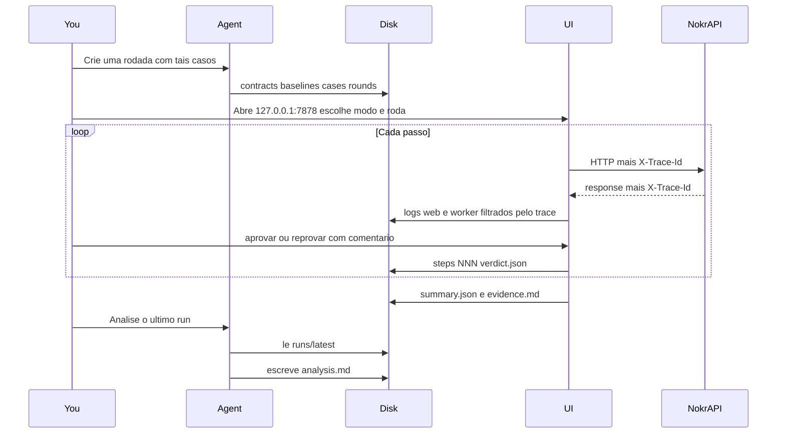
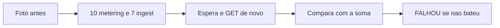

# Nokr QA — especificação e plano de implementação

**Status:** especificação aprovada. Harness nas Fases 1–10 **implementadas**: CLI + UI walk/review + skill `nokr-qa-round` + piloto ingest + conferência 10+7 (`rounds/values-10m-7i.yaml`). A **superfície de browser (A.19)** está **especificada** e é construída nas Fases 11–12 — ainda **não existe** em código: nenhum passo `ui`, nenhum pack `ui.*`, nenhum artefato `steps/*/ui/`.  
**Repositório:** irmão da NokrAPI (`Development/nokr-qa`).  
**Público:** operador (solo founder) e agentes Cursor.  
**Idioma:** prosa em português; identificadores em inglês (`http.baseline`, `H01`, `scaffold-endpoint`).

Este arquivo é a **fonte da verdade**. Parte A descreve o produto. Parte B descreve a ordem de construção. Não implemente duas fases no mesmo PR. Não comece a Parte B sem reler o recorte da Parte A.

Documentos de origem na NokrAPI (não substituídos por este arquivo):

- Playbook: `NokrAPI/docs/manual-test-playbook.md`
- Matriz Trilho A (padrão de cobertura): `NokrAPI/docs/manual-test-trilho-a-matriz.md`
- Guia ingest/metering: `NokrAPI/docs/manual-test-ingest-metering-guia.md`
- Constituição: `NokrAPI/AGENTS.md`
- Collection Bruno: `/home/davi/Documentos/bruno/Nokr API - Dev Collection/`

---

## Índice

- [Parte A — Especificação](#parte-a--especificação-do-produto)
  - [A.1 Visão](#a1-visão)
  - [A.2 Recorte](#a2-recorte)
  - [A.3 Fluxo](#a3-fluxo)
  - [A.4 Arquitetura](#a4-arquitetura)
  - [A.5 Layout futuro do repositório](#a5-layout-futuro-do-repositório)
  - [A.6 Camadas YAML](#a6-camadas-yaml)
  - [A.7 Packs automáticos](#a7-packs-automáticos)
  - [A.8 Origem do status HTTP](#a8-origem-do-status-http)
  - [A.9 Protocolo da matriz Trilho A](#a9-protocolo-da-matriz-trilho-a)
  - [A.10 Schemas](#a10-schemas)
  - [A.11 Logs e X-Trace-Id](#a11-logs-e-x-trace-id)
  - [A.12 Interface (browser)](#a12-interface-browser)
  - [A.13 Artefatos de um run](#a13-artefatos-de-um-run)
  - [A.14 Protocolo do agente](#a14-protocolo-do-agente)
  - [A.15 KPIs](#a15-kpis)
  - [A.16 Configuração e secrets](#a16-configuração-e-secrets)
  - [A.17 Riscos](#a17-riscos)
  - [A.18 Validação cruzada de valores](#a18-validação-cruzada-de-valores)
  - [A.19 Superfície de browser](#a19-superfície-de-browser-kind-d-fases-a5-e-a6)
- [Parte B — Plano de implementação por fases](#parte-b--plano-de-implementação-por-fases)

---

# Parte A — Especificação do produto

## A.1 Visão

Nokr QA é um **harness de review** da API HTTP da NokrAPI. Serve a dois operadores no mesmo contrato de arquivos:

1. **Você (humano)** — escolhe uma rodada, percorre requests no browser, vê payload, resposta, tempo, logs da aplicação e checklist de qualidade, e **aprova** ou **reprova** com comentário.
2. **Agente Cursor** — gera casos de teste em YAML (cobertura ampla, padrão da matriz Trilho A), **não** chama HTTP da UI. Depois do review, lê a pasta do run e escreve a análise narrativa.

A vazão de código gerado por agentes torna o clique avulso no Bruno insuficiente. O harness não substitui o Bruno como cliente do dia a dia. O Bruno continua o **catálogo de requests**. A constituição da NokrAPI continua a exigir atualizar a collection quando um endpoint muda.

O harness **não** é a suíte JUnit da NokrAPI. É evidência de demanda: funcionamento, performance, segurança e regras de negócio / tratamento de erro, configuráveis no início da rodada (modos e dimensões).

## A.2 Recorte

Entra no produto:

- HTTP da NokrAPI: `/auth/**`, `/platform/**`, `/api/**`, `/admin/**`, `/webhooks/**`.
- Sandbox e production no mesmo tenant (namespaces isolados).
- Encadeamento de variáveis (Trilho A: registro → JWT → chave → catálogo → user → ingest).
- Logs da JVM **web** e da JVM **worker** correlacionados por `trace_id`.
- Conferência cruzada de valores (A.18): depois de um lote (ex. 10× metering + 7× ingest), o harness consulta carteira, clientes, overview e financeiro, espera se preciso, e **falha** se o Overview não refletir no timeout. Precisão via **oráculo de dinheiro** (valor exato, não só “andou”).
- Superfície de browser (kind **D**, fases `A5` e `A6`): cinco telas de dinheiro do `nokr-b2b-dashboard` em Chromium, dirigidas pelo runner com o mesmo `trace_id` dos passos HTTP, para conferir o valor **renderizado** contra a API e o `book.json` (A.19).

Não entra:

- Producto cartesiano de todos os campos opcionais ao mesmo tempo (cobertura é **eixo por eixo**).
- OpenAPI do harness como API para o agente.
- Executar `script:pre-request` / `script:post-response` JavaScript do Bruno no v1 (equivalente YAML: `generate: uuid | now_iso | email | cnpj` e `capture:` / `capture_response:` no case).
- Rodar `bru run` na raiz da collection (kill-switch e overlap de rate card destroem a sessão — o playbook já proíbe).
- Scanner de segurança genérico (BOLA e auth são **cases** tagueados `security`, não um plugin).
- Overview refletir Redis no mesmo milissegundo. O harness **espera e tenta de novo**; esgotado o timeout, **FALHOU** (não SKIP).

## A.3 Fluxo



Contrato com o agente: **a pasta do run é a API**. O agente não usa OpenAPI nem `POST` na porta 7878.

Modos da rodada (escolhidos no início, no browser ou no YAML do round):

| Modo | Comportamento |
|---|---|
| `walk` | Para em **todo** passo. |
| `review` | Auto-avança quando expects e packs passam. Para em falha, pack fail, ou `gate: human`. |
| `headless` | Não para. Grava veredito automático (`pass` / `fail`). Serve para o agente validar YAML; não substitui review de mensagem humana. |

Dimensões da rodada (`function`, `performance`, `security`, `business`) **filtram o que executa**. Não apagam a obrigação de o contract no disco estar completo para aquele path.

## A.4 Arquitetura

Um processo Python:

- **Núcleo** `nokr_qa.runner` — independente de HTTP de UI: carrega round, resolve variáveis, dispara httpx, aplica packs, coleta logs, grava `runs/`.
- **Fachada humana** — FastAPI + Jinja2, bind **`127.0.0.1:7878`** (porta configurável). HTML only. Sem SPA Angular/React. HTMX é opcional se o POST de veredito ficar pesado; v1 pode ser form POST clássico.
- **Fachada agente** — CLI + arquivos. Comandos: `nokr-qa validate`, `nokr-qa scaffold-endpoint`, `nokr-qa scaffold-round`, `nokr-qa campaign validate`, `nokr-qa campaign status`, `nokr-qa last-run`, `nokr-qa serve`.

Motor HTTP: **parser de `.bru`** (method, url, headers, body) + **httpx**. Latência medida no cliente Python (não inclui startup Node do `bru`). Scripts JS do Bruno não rodam no v1.

Auth nas chamadas à NokrAPI segue o playbook:

| Superfície | Porta | Auth |
|---|---|---|
| `/auth/**`, `/platform/**`, `/api/**`, `/webhooks/**` | 8080 | JWT + `X-Nokr-Environment` em `/platform`; API Key `nk_test_` / `nk_live_` em `/api`; HMAC em webhooks |
| `/admin/**` | 9090 | `X-Nokr-Admin-Secret` |

O ambiente da API pública vem do **prefixo da chave**, não do path. `X-Nokr-Environment` na API pública **não** troca namespace. Conflito com a chave: produto hoje só em `POST /api/ingest` (P-GAP-6). O harness cobre GET `/api` como **E-conflict 400** sem waive.

## A.5 Layout futuro do repositório

Criado nas fases da Parte B. **Não** existe nesta entrega de documentação.

```
nokr-qa/
  AGENTS.md
  .cursor/skills/nokr-qa-round/SKILL.md
  pyproject.toml
  config.yaml
  secrets.local.yaml          # gitignored
  p-gaps.yaml
  contracts/                  # inventario DTO por endpoint
  baselines/                  # JSON travado (B0, B1, …)
  cases/                      # um YAML por ID (diff do baseline)
  campaigns/                  # listas de rounds (ex.: Trilho A HTTP)
  suites/
  rounds/
  runs/                       # gitignored
  src/nokr_qa/
    runner/
    logs/
    serve/
    oracle/                   # Fase 10 — oráculo de dinheiro
    cli.py
  tests/
  docs/                       # este arquivo (já existe)
```

Adicionar `nokr-qa` ao workspace Cursor junto da NokrAPI. Na Fase 8, um parágrafo em `NokrAPI/AGENTS.md` aponta o irmão.

## A.6 Camadas YAML

Ordem de dependência:

1. **Contract** (`contracts/*.yaml`) — inventário do DTO Java (required/optional, constraints, regras, live-only, P-GAPs). Fonte da cobertura. O agente preenche a partir do `.java`, **não** do exemplo do playbook (P-GAP-4: playbook A2 ainda cita `ai_inference` + `tokens_output`; o contrato travado da sessão é `llm_tokens` + `tokens`).
2. **Baseline** (`baselines/*.json`) — body canônico da sessão (análogo a B0–B5 da matriz). O case **H** envia o baseline inteiro.
3. **Case** — ID estável `{area}-{kind}{nn}` (ex.: `ingest-N-omit-timestamp`). Body = baseline + `diff`. Expects explícitos: `status`, `jsonpath` de negócio, `code` em 422 de catálogo. O resto vem dos packs.
4. **Suite** — ordem, `extract` (JSONPath → variável), `wait_logs_ms`, `gate: auto | human`. Pode incluir passos `loop` (repetir um case N vezes) e `probe` (A.18).
5. **Round** — instancia: suite + modo + dimensões + ambiente (`sandbox` | `production`) + includes. É o artefato do pedido “crie uma rodada”.
6. **Loop, probe e ui** — não são cases H/O/B/N. `loop` dispara o mesmo case N vezes com `generate:` novo a cada iteração. `probe` tira foto antes/depois, aplica o oráculo e compara GETs de conferência. `ui` abre uma tela no Chromium, lê valores e roda os packs de superfície. Schema de `loop` e `probe` em A.18; de `ui` em A.19.

`nokr-qa validate` compara `cases/` contra a **expansão** do contract. Stub com `expect.status` ausente ou `TODO` é erro. Round incompleto **sobe** na árvore do `serve` como `not_ready`, mas **não inicia** HTTP.

Sessão: `interpolate` usa `{**captures, **secrets}` no **body e na URL**. `{{billable_metric_id}}` no path só resolve se um H01 anterior gravou o dest (`capture_response:` ou `contract.captures`). Placeholder sem producer aborta (`PLACEHOLDER_UNRESOLVED`).

No contract: `captures:` (dest → campo JSON da resposta) e `unique_json:` (campo do **unique index** em POST de catálogo — `featureKey` em feature-keys, `name` em plans/metrics/webhooks/api-keys). O runner sufixa `unique_json` em H01 / O-* / B-* / I-new-key. **I-replay reutiliza** `last_idempotency_key` e o valor uniquificado da sessão — não gera UUID novo. Sem chave anterior: `CAPTURE_MISSING` (instrumento), não 409 de nome. `capture_response` com campo ausente no JSON **não** aborta o round: o step é gravado e o dest não é preenchido.

`nokr-qa validate` e `nokr-qa campaign validate` recusam cadeia partida: `{{name}}` num round **antes** de existir producer (`capture_response`, `contract.captures`, `capture:`, ou `generate: uuid` no H01); `E-isolate` em round `sandbox` com expect 200 (matriz: **403** pré Go-Live); POST de catálogo (`/platform/billable-metrics`, feature-keys, plans, webhooks, api-keys, rate-cards) com `name` / `featureKey` e `idempotency: header_uuid_v4` sem `unique_json`.

## A.7 Packs automáticos

Rodam em **toda** request, sem o agente declarar. Resultado na UI como checklist. Opt-out só via `waive` (Camada A.9).

### `http.baseline` (sempre)

- Nunca 5xx, salvo case cujo `expect.status` é 5xx **e** tem waive de caos. **500 é falha dura de produto.**
- Status HTTP igual ao `expect.status` daquele case. 422 num H01 que espera 201 é fail (`HTTP 422, expected 201`), mesmo com envelope de erro válido.
- Header de resposta `X-Trace-Id` presente e igual ao enviado pelo harness.
- Se `Content-Type` é JSON: body parseável. 204 vazio é ok.
- Body **não** contém stack (`at com.nokr`, `\tat `), SQL/Hibernate/JDBC (espelha `ClientErrorSanitizer` da NokrAPI), nem segredo (`nk_test_`, `nk_live_`, JWT `eyJ`, senha, admin secret).
- Tempo gravado. Fail se `elapsed_ms > fail_ms`. Warn se `> budget_ms` (KPI; no modo `review` o warn sozinho não bloqueia, a menos que a dimensão `performance` esteja ligada — aí warn sobe a fail).

### `http.success` (expect 2xx)

- Logs web do trace: zero linhas `ERROR`. `WARN` no happy path vira warn do pack.
- Pelo menos uma linha de log web com o `trace_id`. Senão `logs_incomplete` = fail do pack.
- Sucesso **não** devolve envelope `{error, traceId}` no body (trace é header). `MeteringResponse` já moveu trace para `X-Trace-Id`.

### `http.error` (expect 4xx **e** HTTP real 4xx)

- Só corre quando o **status real** é 4xx. Expect 409 com HTTP 201 **não** gera `error must be a non-empty string` — isso é mismatch de `http.baseline`. Expect 201 com HTTP 422 também não abre este pack.
- Envelope `ApiErrorBody`: `error` (string não vazia), `traceId` (string igual ao header). `code` obrigatório quando o handler é `CatalogContractException` / `ProductRuleException` (422 de catálogo/regra).
- `error` não é FQCN Java.
- `error` em português de Bean Validation (`tamanho deve`, `não deve estar`, `deve ser entre`) é fail de **produto (locale)**.
- Ver [A.8](#a8-origem-do-status-http) (`http.status_origin`).

### `business.rule` (sempre)

Classifica 4xx contra o catálogo `rules[]` do contract (`code` ou substring `error`).

- H01 / expect 2xx: nenhuma regra permitida. `DUPLICATE_EMAIL` num register H01 é fail (`unexpected business error DUPLICATE_EMAIL on H01`).
- `N-rule-{id}`: só `{id}`. Outra regra ou 4xx não classificado → fail.
- N-omit / N-pattern / N-over: Bean Validation, não `rules[]`. Uma regra classificada → fail.

### `observability` (sempre)

- Linha `trace_id: [<id>]` no log do processo certo (web para HTTP síncrono; web **e** worker se `wait_logs_ms` ou rota async ingest/ledger).
- Mensagens de log em inglês (constituição). Heurística: fail se houver token claramente PT (`não`, `erro ao`, `falha na`).
- Metering hot path está em WARN no `logback-spring.xml`: **não** exigir `INFO` nesses loggers.

### `auth.surface` (pelo prefixo da rota)

- `/api/**` — `Authorization: Bearer nk_test_` ou `nk_live_` coerente com `environment` do round.
- `/platform/**` — JWT + `X-Nokr-Environment: sandbox|production`.
- `/admin/**` — `X-Nokr-Admin-Secret`, base `:9090`.
- `/webhooks/**` — HMAC; não Bearer de tenant.
- **N-auth** (ou `omit_headers` com `Authorization`): **não** exige Bearer. O VP é o 401 + envelope (`http.baseline` / `http.error`). 401 sem `X-Trace-Id` continua fail de produto.

### `mutation` (POST/PUT/PATCH/DELETE)

- Onde a constituição exige: `X-Idempotency-Key` UUID v4 no happy path (metering, ingest, mutações `/platform` de catálogo/planos).
- Exceções só via waive (A0/A1 keys/webhooks/settings; `POST /api/users` é P-GAP-5).
- Runner gera UUID v4 lowercase se o case não fixar a key.

### `performance` (sempre, dois limiares)

A constituição pede p99 abaixo de 50 ms no hot path de produção. Isso **não** é `fail_ms` no laptop (JVM fria, debugger). Senão tudo fica vermelho e a ferramenta é ignorada.

Valores default em `config.yaml` (ajustáveis):

| Rota | `budget_ms` (KPI / warn) | `fail_ms` (absurdo local) |
|---|---|---|
| `/api/metering`, `/api/ingest` | 50 | 1500 |
| Demais `/api` e `/platform` | 200 | 2000 |
| KYC / onboarding | 8000 | 8000 |
| Default | 1500 | 1500 |

Dimensão `performance` no round: warn sobe a fail.

### `security.leak` (sempre)

Subset do baseline focado em leak. View-once de API key: o harness **blanca** `raw_key` / `rawKey` / `api_key` / `jwt` no body 2xx (igual ao register). `nk_test_` em `error` ou em header continua fail. O GET seguinte **não** pode vazar a chave.

`verdict.json` nos fails automáticos leva `cause`: `product` (status, 5xx, 4xx sem trace, N-rule classificada, PT no `error`), `instrument` (N-over classificado como `rules[]`; N-rule de quota ainda 2xx após `saturate`) ou `pack` (residual). `summary.counts.instrument` conta o segundo para o relatório de campanha não misturar com produto.

### `values.oracle` e `values.consistency` (passos `probe`, A.18)

Não rodam em toda request. Só no passo `probe`.

- **`values.oracle`** — o débito que realmente ocorreu (metering 202 com `status: SUCCESS`; ingest com `quantities[].rating.status = SUCCESS`) tem de igualar o valor calculado pelo oráculo, escala 5, mesmas regras do Java. “O número andou” **não** passa.
- **`values.consistency`** — cada superfície da tabela A.18 tem o delta declarado (`exact`, `increase`, `unchanged`). Overview: espera e tenta de novo até o timeout; esgotado, **FALHOU** (não SKIP).

## A.8 Origem do status HTTP

Tabela da matriz Trilho A — o pack `http.status_origin` usa isto, não o exemplo do playbook:

| Origem | Status |
|---|---|
| Bean Validation (`@NotBlank`, `@Size`, `@Pattern`, `@DecimalMin`, `@NotNull`, `@NotEmpty`, `@AssertTrue`) | **400** |
| Compact ctor no parse JSON (Jackson envolve `IllegalArgumentException`) | **400** com a mensagem da causa |
| `IllegalArgumentException` no service/entidade (já instanciado) | **422** |
| `CatalogContractException` / `ProductRuleException` | **422** + `code` |
| `ResponseStatusException` | o status do throw |

Se o case esperava 400 e veio 422 (ou o inverso) **sem 500** e o body **não** casa com um `rules[]`: warn `http.status_origin` + `gate: human`. Não é falha dura de produto. **Só 500 é fail duro.** Happy path (H01) com 422 de negócio continua fail em `http.baseline` e `business.rule`.

Envelope de erro estável (`com.nokr.core.web.ApiErrorBody`): `error`, `traceId`, `code` opcional.

## A.9 Protocolo da matriz Trilho A

A matriz (`NokrAPI/docs/manual-test-trilho-a-matriz.md`) **não** é um checklist só de ingest. É o protocolo de cobertura de **qualquer** endpoint no Nokr QA (register, webhooks, rate cards, users, activate, ingest).

Fonte da verdade do case: **DTO Java + Bean Validation + compact ctor + throws do service**. Não copiar o body de exemplo do playbook.

### Regras de escrita (`validate` recusa se violar)

1. **Baseline travado** — um JSON canônico por endpoint. H usa o baseline inteiro. Todo O/B/N é `diff`.
2. **Um defeito por case** — não misturar dois erros no mesmo body (exemplo da matriz: profundidade de filter vs número de cláusulas = dois POSTs). N-over **não** usa `'x'*n` em campo com charset / `@StrongPassword`: a semente é `example` (ou `Aa1x` se o campo se chama `password`) repetida até `max_length+1`.
3. **H é âncora** — um happy path rico. Se o H da etapa falhar, a suite **não avança** o resto da etapa. Variantes N/O rodam depois, com ids **descartáveis**, para não contaminar saldo/catálogo da sessão.
4. **Isolar o campo** — omitir cada `@NotBlank` / `@NotNull` **um a um**. Cada `@Pattern` inválido é um N. Chaves de denylist com regra distinta (cpf vs lat) viram N próprios.
5. **Opcional é cobertura** — para **cada** campo `required: false`: um O omitindo (assertiva do default) e um O enviando valor válido. PATCH parcial: um O **por campo sozinho**.
6. **Boundary na annotation** — para cada `@Size` / `@DecimalMin` / max de lista: B no min exato e no max exato (2xx); N imediatamente abaixo/acima. Cap de negócio (test-drive DEVELOPER 5.00 → 422) é distinto do teto de Bean Validation (20.00001 → 400).
7. **Regra de negócio isolada** — cada invariante (COUNT com `property_path`, FLAT com 2 tiers, reserved key, overlap, imutável, janela de timestamp, denylist, unique) é um N com o `code` **ou** `error` que o handler expõe. `nokr-qa validate` recusa `rules[]` sem um dos dois. Quota / teto (SANDBOX_LIMIT, RATE_LIMIT): `saturate` (POST até o 4xx ou `max`) ou `burst` no rule, copiados para o case. `burst: 5` **não** é “+5 neste case” se H01 já criou chaves.
8. **SKIP ≠ FALHOU** — worker parado, Mock 409, P-GAP: `skip` + nota **nos cases isolados da matriz**. P-GAP vive em `p-gaps.yaml`. Não marcar fail de produto se o HTTP bater com o código atual. **Exceção A.18:** suite com `loop` ingest + `probe` — poll no timeout e Overview no timeout são **FALHOU**, não SKIP.
9. **D (dashboard)** — não é gerado por `scaffold-endpoint`: o kind D não tem contrato de DTO. Rounds de superfície se declaram como passo `ui` na suite, com `matrix: A5` ou `A6` (A.19).
10. **Campo extra ignorado pelo DTO** — um O documentando “ignorado” (P-GAP-2 `description` no cash-in), não um N 400 inventado.

### Kinds que `scaffold-endpoint` gera a partir do contract

Não é um único `N-validation` genérico. Expansão:

| Kind | Quando gera |
|---|---|
| **H01** | Sempre. Baseline da sessão (ingest = `llm_tokens` + `tokens`, não `ai_inference` velho). |
| **O-omit-{field}** / **O-set-{field}** | Cada optional. PATCH: +1 por campo isolado. `@JsonAlias`: +1 O snake/camel se o DTO declara alias. |
| **B-min-{constraint}** / **B-max-{constraint}** | Cada constraint numérica/tamanho/lista (password 8 e 64; name 3 e 50; `allowed_properties` 32; timestamp +4 min e −47 h se houver janela). |
| **N-omit-{field}** | Cada required. |
| **N-pattern-{field}** | Cada `@Pattern` / enum inválido. |
| **N-over-{constraint}** | Lado de fora do B (max+1 / min−1). |
| **N-auth** | Sem credencial ou credencial inválida → 401/403. |
| **N-rule-{id}** | Cada `rules[]` (422+code, 409 unique, 429 rate limit, 402 saldo, 403 frozen). |
| **N-notfound** / **S-bola** | Path com id de recurso tenant-scoped. Tenant B no recurso A → 404 ou 403, nunca 200. |
| **I-replay** / **I-new-key** / **I-missing** / **I-format** | Se `idempotency: header_uuid_v4`. Formato: v1, `abc`, v4 maiúsculo (regex lowercase). Se a dedup **não** é o header, `dedup: transaction_id` (ingest). I-replay reutiliza a chave da sessão. |
| **E-isolate** | GET/list **JWT `/platform`** com `X-Nokr-Environment: production` em round **sandbox** → **403** (pré Go-Live). Não se aplica a GET `auth: api_key`. Scaffold não clona o 200 do H01. |
| **E-conflict** | Header `X-Nokr-Environment` conflita com o prefixo da API key → **400**. Contract com `P-GAP-6` ou `environment_conflict`. GET `/api` e `POST /api/ingest`. Sem waive: vermelho até o produto rejeitar em todo `/api`. |
| **P-*** | Cada `live_only_rules[]` (HTTPS webhook, CDC 30d, production keys locked, activate exige CNPJ). |

Não é produto cartesiano de opcionais. É **eixo por eixo**.

### Waive

```yaml
waive:
  - pack: mutation.idempotency
    reason: "POST /platform/api-keys is view-once; playbook A1 does not send X-Idempotency-Key"
  - kind: S-bola
    reason: "Public health/register has no tenant resource id"
  - kind: N-rule-simulate-live
    p_gap: P-GAP-1
    reason: "SandboxSimulationService does not reject nk_live_; see p-gaps.yaml"
```

Motivo ≥ 40 caracteres **ou** `p_gap: P-GAP-n`. Agente não inventa waive: copia do playbook / `p-gaps.yaml`.

### Sessão (suites tipo Trilho A)

- Folha de variáveis SBX/LIVE (JWT, keys, ids).
- Catálogo travado no `suite.yaml` (event_type, property_path, unit_amount). Se mudar a métrica, muda o baseline do ingest — não o contrário.
- Namespaces **não copiam**. Depois do Go-Live, H de catálogo/plano no LIVE são IDs novos.
- Restaurar estado depois de N destrutivo (re-default do plano, whitelist da métrica, test-drive 5.00) antes do próximo H.

P-GAPs conhecidos da matriz (copiar para `p-gaps.yaml` na Fase 2):

| ID | Playbook / expectativa antiga | Código atual |
|---|---|---|
| P-GAP-1 | `simulate-*` com `nk_live_` deve falhar | Grava prefixo `nk_test_` sem rejeitar a chave live |
| P-GAP-2 | Body cash-in com `description` | `DepositIntentRequest` não tem o campo (ignorado) |
| P-GAP-3 | Check em snake_case | `userId` / `featureKey` / `context` em camelCase |
| P-GAP-4 | Ingest A2 `ai_inference` + `tokens_output` | Travar o catálogo da sessão (`llm_tokens` + `tokens`) |
| P-GAP-5 | `POST /api/users` + `X-Idempotency-Key` | Header não é exigido; upsert pelo `external_user_id` |
| P-GAP-6 | Conflito `X-Nokr-Environment` em todo `/api` | Só `POST /api/ingest` |
| P-GAP-7 | Preview com as mesmas regras de POST | Preview não valida denylist, tamanho de properties nem janela de timestamp |
| P-GAP-8 | Login lockout com erro `LOCKED` distinto | Cinco falhas travam o tenant; o HTTP continua `"Invalid credentials"` (defesa de timing) |

## A.10 Schemas

Exemplos **fechados**. Implementação futura valida contra estes formatos.

### Contract (`contracts/api-ingest-post.yaml`)

Campos alinhados a `com.nokr.domain.metering.ingest.dto.IngestRequest`.

```yaml
endpoint: POST /api/ingest
dto: com.nokr.domain.metering.ingest.dto.IngestRequest
auth: api_key
idempotency: header_uuid_v4
dedup: transaction_id
async: worker
captures:
  ingest_transaction_id: transaction_id
baseline: baselines/ingest-sum.json
fields:
  transaction_id:
    required: true
    json: transaction_id
    max_length: 128
    pattern: "^[A-Za-z0-9._:-]+$"
  customer_id:
    required: true
    json: customer_id
    max_length: 128
  event_type:
    required: true
    json: event_type
    max_length: 64
    pattern: "^[a-z][a-z0-9_]*$"
  timestamp:
    required: true
    json: timestamp
    window:
      future_minutes: 5
      past_hours: 48
  properties:
    required: true
    json: properties
    flat: true
    max_keys: 32
    denylist:
      - cpf
      - cnpj
      - cpf_cnpj
      - ssn
      - passport
      - biometric
      - face_id
      - geolocation
      - lat
      - lon
      - latitude
      - longitude
      - precise_location
rules:
  - id: UNKNOWN_EVENT_TYPE
    status: 422
    code: UNKNOWN_EVENT_TYPE
  - id: MISSING_PROPERTY
    when: "SUM, MAX or UNIQUE and path field absent or non-numeric"
    status: 422
    code: MISSING_PROPERTY
  - id: UNKNOWN_CUSTOMER
    status: 404
    error: User not found
live_only_rules: []
p_gaps:
  - P-GAP-6
  - P-GAP-7
```

### Baseline (`baselines/ingest-sum.json`)

Contrato da sessão (matriz §3 / B5). Timestamp de exemplo é ilustrativo; o runner substitui por ISO **agora** quando o case pede `generate: now_iso` (janela de 48 h).

```json
{
  "transaction_id": "evt-ta-001",
  "customer_id": "{{external_user_id}}",
  "event_type": "llm_tokens",
  "timestamp": "2026-09-01T12:00:00Z",
  "properties": {
    "model": "gpt-4o",
    "tokens": 100
  }
}
```

### Case N-omit (`cases/ingest/ingest-N-omit-timestamp.yaml`)

Um defeito: omitir `timestamp`. Baseline + diff.

```yaml
id: ingest-N-omit-timestamp
contract: contracts/api-ingest-post.yaml
kind: N-omit-timestamp
gate: auto
tags:
  - function
  - business
bru: Public API/8. B2B Integration — Ingest (api)/POST -api-ingest — Custom.bru
diff:
  omit:
    - timestamp
expect:
  status: 400
generate:
  transaction_id: uuid
  idempotency_key: uuid_v4
```

Kind desconhecido em `generate:` falha (`GENERATE_UNKNOWN`); o runner **não** grava o literal `"email"` no body. Identidade: `email`, `password`, `person_name`, `company_name`, `address`, `cpf`, `cnpj` (faker `pt_BR` / validate-docbr). Login: `secret.email` / `secret.password` reusa o capture do `register-H01` (`runs/shared-captures.json`) ou `secrets.local.yaml`. Sentinela `replace-with-generate` ou `{{email}}` no baseline é preenchida: secret da chave, senão fixture. CLI: `nokr-qa fixture KIND` (JSON no stdout). `capture:` grava um campo do **request body** depois do generate em `runs/<id>/captures.json`. `capture_response:` grava um campo do **JSON de resposta** depois do HTTP (`register-H01` → `jwt` / `refresh_token` / `api_key`; `api-keys-post-H01` → `raw_key` como `api_key` e `id` como `api_key_id`; POST de catálogo → `billable_metric_id` / `plan_id` / `feature_key` / `webhook_id`). `{{placeholders}}` no body e na URL interpolam **captures + secrets**. O case seguinte reusa com `generate: {email: captured.register_email}` ou `secret.jwt`. Capture em falta: `CAPTURE_MISSING` (`captured.register_email missing`). Auth jwt/api_key também lê `runs/shared-captures.json` quando `secrets.local.yaml` está vazio.

### Round

```yaml
id: ingest-contract-2026-09-01
suite: suites/trilho-a-ingest.yaml
mode: review
dimensions:
  - function
  - business
environment: sandbox
notes: "Demanda: contrato SUM sem properties.tokens e omit required"
include:
  - cases/ingest/ingest-H01.yaml
  - cases/ingest/ingest-N-omit-timestamp.yaml
  - cases/ingest/ingest-N-rule-MISSING_PROPERTY.yaml
```

`loop` e `probe` não entram no round: ficam na suite. Schema e o exemplo 10+7 estão em A.18.

### `verdict.json`

```json
{
  "status": "fail",
  "actor": "human",
  "comment": "Envelope ok but error string is the Java exception class name",
  "continue": true
}
```

`status`: `pass` | `fail` | `skip`. `actor`: `human` | `auto`. Reprovar exige `comment`. `continue: false` encerra a rodada.

### `summary.json` (campos obrigatórios)

```json
{
  "round_id": "ingest-contract-2026-09-01",
  "mode": "review",
  "counts": {
    "pass": 0,
    "fail": 0,
    "skip": 0,
    "http_5xx": 0
  },
  "packs": {
    "fail": 0,
    "warn": 0
  },
  "coverage_pct": 0,
  "latency_ms": {
    "p50": 0,
    "p95": 0
  },
  "logs_incomplete": 0,
  "human_reject_rate": 0,
  "review_duration_ms": 0
}
```

## A.11 Logs e X-Trace-Id

Pattern do logback (console e ficheiro):

```text
trace_id: [%X{trace_id:-system}]
```

Web e worker são **dois JVMs** (IntelliJ ou `./mvnw spring-boot:run` com profiles `web` e `worker`). Profile `web` grava `logs/nokr-web.log` no logback (sem `application-web.yml`). Profiles `worker` / `admin` ligam ficheiro via `application-{profile}.yml` (`NOKR_LOGGING_FILE_ENABLED` ainda pode desligar nesses dois). `RollingFileAppender` (20 MB, `totalSizeCap` 80 MB, cwd = raiz do módulo NokrAPI). Console permanece. Profile `test` não instancia FILE. O harness lê só a cauda (offset de bytes **antes** do HTTP) e filtra `trace_id: [<id>]`.

`JwtAuthenticationFilter` e `ApiKeyAuthenticationFilter` honram `X-Trace-Id` incoming; só geram UUID se o header estiver ausente ou em branco. `MdcLoggingFilter` lê o header e faz `response.setHeader("X-Trace-Id", traceId)`.

O harness, em cada passo:

1. Envia `X-Trace-Id: nokrqa-<run>-<step>`.
2. Lê o header da resposta (enviado e recebido gravados).
3. Se o case tem `wait_logs_ms` (ingest), espera.
4. Filtra linhas `trace_id: [<id>]` nos arquivos web e worker.
5. Grava `logs-web.txt` e `logs-worker.txt`. Fallback: janela ±1 s se o id não aparecer; marca `logs_incomplete: true`.

Workers (`RatingWorker`, `CatalogAggregatorWorker`, `LedgerWorkerService`) já colocam o `trace_id` do header RabbitMQ no MDC — o mesmo id atravessa o cold path.

`config.yaml` aponta os paths (default: `../NokrAPI/logs/...`). IntelliJ precisa da working directory no módulo NokrAPI para o arquivo existir.

Sem worker no ar: um case H **isolado** da matriz que espera `rating.status` / saldo caído → **SKIP**, não falha de produto (igual o playbook). Uma suite com `loop` de ingest + `probe` (A.18) **não** SKIP: o poll de `GET /api/ingest/{id}` no timeout **FALHOU**. Worker parado vira falha visível nesse lote.

## A.12 Interface (browser)

HTTP **só para o operador**. Bind `127.0.0.1`. Sem exposição de JWT/`nk_test_` fora da máquina. O agente **não** chama `127.0.0.1:7878`.

`nokr-qa serve` sobe o workspace da **coleção** (campanhas + rounds órfãos). Path opcional foca uma campanha ou um round; YAML ilegível continua `ROUND_INVALID` e não sobe. Round parseável mas incompleto (`validate` com TODO / cobertura) **sobe** na árvore como `not_ready` e **não inicia**.

Duas colunas (a fila de uma rodada é o nível mais baixo da árvore):

- **Esquerda — Coleção.** Campanha → fluxo (`matrix` A0–A4 ou suite com `steps`) → endpoint (round) → caso. Status: `missing` / `not_ready` / `not_reviewed` / `pass` / `fail` / `http_5xx` / `skip`. Round com run: clicar um caso mostra o passo **sem** reenviar HTTP. **Reexecutar** cria `runs/<stamp>-…` novo. **Anterior** / **Próximo** no round em curso. Passos `loop` e `probe` aparecem como um item cada (não 17 linhas iguais).
- **Direita:** rollup da campanha, formulário Iniciar/Reexecutar, ou review (packs, probe, HTTP, veredito sticky).
- Passo `probe`: tabela **esperado vs lido** — foto antes, foto depois, delta, oráculo (`esperado R$ X` / `lido R$ Y` nas superfícies de dinheiro) por superfície. Pack `values.oracle` / `values.consistency` na checklist. Sem POST vazio no lugar do HTTP.
- Pack fail impede auto-avançar no modo `review` mesmo se `expect.status` bateu.
- Reprovar: comentário obrigatório; **Reprovar e seguir** ou **Reprovar e parar**.
- Aprovar: segue; comentário opcional.
- Fim: KPIs + caminho `runs/<id>/`.

Um processo = **um** round HTTP de review de cada vez. Se há veredito pendente, iniciar outro é `ROUND_BUSY`. Sem “correr a campanha toda”. Sem Send de um case isolado. Sem editor de YAML no browser.

Passo `ui`: mostra, por tela, o **ARIA snapshot** lido, o valor capturado de cada `surface` **esperado vs lido**, violações do axe com o nó apontado, e erros de console com a stack. Screenshot aparece quando o pack `ui.visual` não estiver waivado. Sem exibir JWT nem `nk_test_` (mesma regra de redact de A.13).

## A.13 Artefatos de um run

```
runs/2026-09-01T0130-ingest-contract/
  round.yaml
  summary.json
  evidence.md              # factual: tabela, comentarios humanos, KPIs
  analysis.md              # o agente escreve depois; o harness nao gera narrativa
  book.json                # livro-razão do oráculo: o que entrou na soma e o que foi excluído
  steps/003-ingest-N-omit-timestamp/
    request.json
    response.json
    timing.json
    logs-web.txt
    logs-worker.txt
    packs.json
    verdict.json
  steps/007-ui-overview/          # passo ui (A.19)
    ui.json                       # navegação: url, tela, estado, duração, comparação estrutural
    aria.yml                      # snapshot estrutural da região lida
    a11y.json                     # violações WCAG A/AA (axe-core), com o nó apontado
    ui-values.json                # surface -> valor renderizado
    console.log                   # erro/warn do browser
    network.json                  # requests observadas, com trace_id
    screenshot.png                # só se ui.visual não estiver waivado
  probes/values-10m-7i/
    before.json
    after.json
    delta.json
    oracle.json            # esperado por superfície vs lido
    packs.json
    verdict.json
```

`runs/latest` é symlink para o último run. `nokr-qa last-run` imprime o path absoluto.

Redact nos JSON gravados: prefixo `nk_test_` / `nk_live_`, JWT, admin secret.

O harness gera **evidência**. A análise (raiz no Java, 400 vs 422, worker parado, waive suspeito) é `analysis.md` escrito pelo agente.

Round “pronto para o agente analisar”: zero 5xx, zero pack fail não-waivado. Warns e comentários humanos vão para a análise.

## A.14 Protocolo do agente

Não é um servidor para o Cursor bater. É **arquivos + skill + CLI**.

### Skill (Fase 8)

`.cursor/skills/nokr-qa-round/SKILL.md` dispara em: “crie uma rodada”, “cubra o Trilho A HTTP”, “analise a campanha”, “Nokr QA”, “analise o último run”.

### Pedido: crie uma rodada para `POST /api/ingest` (qualquer rota)

1. Abrir o **record DTO** Java (`@NotBlank`, `@Size`, `@Pattern`, `@DecimalMin`, `@NotNull`, `@NotEmpty`, `@JsonAlias`, compact ctor) e os throws do service/entidade.
2. Escrever `contracts/<path>.yaml` + `baselines/<path>.json` (contrato da sessão, não o exemplo do playbook).
3. Se o request não existe no Bruno, criar o `.bru` **e** o case (constituição).
4. `nokr-qa scaffold-endpoint` → stubs H/O/B/N/I/E/P.
5. Preencher diffs e `expect.status` / `code` **um eixo por vez**. N-over não usa `'x'*n` em charset; N-rule de quota leva `saturate`/`burst` + `error:`. Cada `rules[]` precisa de `code` ou `error`.
6. `nokr-qa validate` até 0 errors.
7. Só então avisar o operador para abrir `nokr-qa serve` (`http://127.0.0.1:7878`).

### Pedido: cubra o Trilho A HTTP / gere a campanha trilho-a

Não gerar um único round com ~320 IDs. Kind **D**, A5 e A6 ficam de fora. Não misturar `rounds/values-10m-7i.yaml`.

1. YAML até `nokr-qa campaign validate campaigns/trilho-a-http.yaml` = 0 errors. O validate checa a cadeia: producer (`capture_response` / `contract.captures` / `generate: uuid`) **antes** de cada `{{placeholder}}`; E-isolate sandbox = 403; `unique_json` nos POST de catálogo.
2. H01 de POST que cria recurso declara `capture_response` **antes** de rounds PUT/PATCH/DELETE com `{{id}}` no path. Não hardcodar `ext-ta-001` — `customer_id` / `external_user_id` vêm de `generate: uuid` + capture.
3. Avisar: `nokr-qa serve` — o operador orquestra a árvore. O agente **não** chama 7878.
4. No fim: `nokr-qa campaign status` + `runs/` + `analysis-campanha.md`.

### Pedido: 10 metering + 7 ingest e valida overview (A.18)

O agente gera **um** `loop` de metering, **um** `loop` de ingest (poll de status depois de cada um) e **um** `probe` — não 17 arquivos H iguais. Rate card da sessão é input do oráculo (P-GAP-4). Schema e exemplo em A.18.

### Pedido: analise o último run

1. `nokr-qa last-run` (ou `runs/latest`).
2. Ler `summary.json`, `steps/*/verdict.json`, `packs.json`, logs, `evidence.md`, e se existir `book.json` + `probes/*/`.
3. Escrever `analysis.md`: produto vs `verdict.cause` `instrument`/`pack`, O/B faltando no contract, waives sem P-GAP, 400/422 trocados, SKIP de worker, **oráculo vs lido** (se o probe falhou: esperado R$ X / lido R$ Y, superfície, se o Overview esgotou o timeout). `summary.counts.instrument` não conta como defeito de produto.

O agente **não** chama a porta 7878.

Campanha = árvore (um path HTTP por round, A0–A4). O operador orquestra na UI (`nokr-qa serve`); o agente só CLI + YAML + `runs/`. Relato no fim: `nokr-qa campaign status` + cada `runs/*-<id>/` + `analysis-campanha.md`. Kind D / A5 / A6 fora.

Texto a incluir em `AGENTS.md` (Fase 8), resumido:

- Nokr QA mora neste repo. Spec: `docs/nokr-qa.md`.
- Nunca commitir `secrets.local.yaml`.
- Nunca entregar só happy path.
- Fonte do contract = DTO Java.
- Preferir `.bru` existente; se criar request novo, atualizar Bruno.
- Não inventar waive.

## A.15 KPIs

`summary.json` / `evidence.md` / tela final:

- Contagem 5xx (meta **0**).
- `summary.counts.instrument` (eixo sujo / quota não saturada) — não misturar com produto.
- Pack fail / warn (inclui 400-vs-422 sem 500).
- Cobertura vs contract (% kinds gerados com expect preenchido).
- Latência p50/p95 vs `budget_ms` por passo e da rodada.
- `logs_incomplete`.
- Taxa de reprovação humana (expect frouxo ou produto ruim).
- Tempo total de review (sinal de que `walk` está caro).
- Falhas de `values.oracle` / `values.consistency` (oráculo ≠ lido; Overview no timeout).
- Falhas de `ui.value` (tela divergente da API) — alvo 0, e **nunca** waivável sem P-GAP.
- Violações WCAG A/AA por tela — alvo 0 nas telas de escopo.
- Erros de console por passo `ui` — alvo 0.

## A.16 Configuração e secrets

### `config.yaml` (versionado)

```yaml
bruno_collection: /home/davi/Documentos/bruno/Nokr API - Dev Collection
nokr_web: http://127.0.0.1:8080
nokr_admin: http://127.0.0.1:9090
ui:
  host: 127.0.0.1
  port: 7878
log_files:
  web: ../NokrAPI/logs/nokr-web.log
  worker: ../NokrAPI/logs/nokr-worker.log
  admin: ../NokrAPI/logs/nokr-admin.log
budgets_ms:
  hot_path:
    budget: 50
    fail: 1500
  default:
    budget: 1500
    fail: 1500
  kyc:
    budget: 8000
    fail: 8000
probes:
  ingest_poll_ms: 8000
  ledger_ms: 8000
  overview_ms: 30000
register_gap_ms: 2000
```

### `secrets.local.yaml` (gitignored)

JWT, `nk_test_`, `nk_live_`, admin secret. Round e cases só referenciam `{{api_key}}`, `{{jwt}}`. Nunca colar chave no YAML da rodada.

## A.17 Riscos

- Scripts `pre-request` do Bruno (`ingest_transaction_id = Date.now()`) precisam de `generate:` no YAML. Sem isso, replay/idempotência quebra.
- Sem worker, `logs-worker.txt` vazio no ingest **isolado** da matriz: SKIP / `logs_incomplete`, não fail de produto. Suite A.18 (loop ingest + probe): poll no timeout = **FALHOU**. Overview lento até `probes.overview_ms` = **FALHOU**, não SKIP. ClickHouse/worker parado tem de aparecer como falha.
- `GET /platform/tenants/users/summary` → `total_balance` é `SUM(users.balance_amount)` no Postgres (não Redis). Test-drive **PROMOTIONAL**: não use esse campo como prova de débito. Use `GET /api/users/{id}/balance` (`$.balance`) e `GET .../users/{id}/metrics` (`$.total_billed_lifetime`). Detalhe em A.18.
- Overview `revenue.gross_volume` vem de `dashboard_revenue_mv` (só `REAL` + `CREDIT`). Lote promocional **não** move esse campo; o jsonpath certo é `conversion.test_drive_consumed_percent` (débito PROMOTIONAL no ClickHouse). Escolher o campo errado faz o teste mentir.
- `headless` não julga mensagem humana.
- `fail_ms` = 50 ms no hot path local destrói a ferramenta.
- Matriz eixo-a-eixo ainda gera muitos cases (a do Trilho A tem ~320 IDs). O piloto (Fase 9) cobre **um** path (ingest) completo, não a collection inteira. Conferência 10+7 é Fase 10, não misturar com o piloto nem com a Fase 4.
- Agente que preenche o contract olhando só o playbook reproduz P-GAP-4 (o oráculo de ingest usa o catálogo da **sessão**).
- `POST /auth/register` tem token bucket por IP (capacidade 3, refill ~0,6/s). Sem `register_gap_ms` a rodada inteira toma 429 a partir do 4.º case. O case `N-rule-RATE_LIMIT` usa `burst: 4` no mesmo body para esgotar o bucket de propósito.
- Jwt/ApiKey honram `X-Trace-Id` incoming (Fase 3). Sem header, geram UUID.

## A.18 Validação cruzada de valores

**Sim, dá para fazer.** Depois de 10× `POST /api/metering` e 7× `POST /api/ingest`, o Nokr QA sozinho tira foto, soma o que debitou de verdade, espera os GETs e **exige o valor certo** — não só “o número andou”. Overview que continuar velho no timeout **falha**.

Isto é spec. O harness implementa na Fase 10. Sem 17 arquivos H iguais: um `loop` + um `probe`.

### Os 5 passos na prática

1. **Foto antes.** GET de carteira, clientes, overview e financeiro (tabela abaixo).
2. **Lote.** 10 metering (idempotency nova a cada um) e 7 ingest (`transaction_id` novo a cada um). Depois de cada ingest, poll de `GET /api/ingest/{id}` até `quantities[].rating.status` sair de `PENDING` (timeout `probes.ingest_poll_ms`, default 8 s). Ingest **202 não é débito**.
3. **Soma só o que debitou.** Metering HTTP 202 com `status: SUCCESS`. Ingest com `rating.status = SUCCESS`. Fora da soma: 402, ingest `INSUFFICIENT` / `FROZEN`, replay (`transaction_id` ou idempotency repetidos), 429.
4. **Foto depois.** Se ainda não bateu, espera e repete o GET até o timeout (`probes.ledger_ms` 8 s nas superfícies de ledger; `probes.overview_ms` 30 s no Overview).
5. **Compara com o oráculo.** Carteira caiu **exatamente** o total. Transações do cliente aumentaram. Overview refletiu o jsonpath certo. Financeiro neste lote **não mudou**. Se o GET balance caiu 0.003 e o oráculo era 0.030, **falhou** mesmo com Overview e lista “andando”.



### Esta tela deve mudar / não deve

Campos JSONPath são os `@JsonProperty` dos records Java. Não inventar chave.

| Superfície | GET | jsonpath | Lote 10 metering + 7 ingest (test-drive PROMOTIONAL) |
|---|---|---|---|
| Carteira | `/api/users/{external_id}/balance` | `$.balance` | **Deve** cair exatamente o oráculo. Redis, imediato no metering 202; no ingest só depois de `SUCCESS`. |
| Cliente — transações | `/platform/tenants/users/{nokr_user_id}/transactions` | `$.page.total_elements` | **Deve** aumentar (ledger worker). Contagem, não o valor da carteira. |
| Cliente — métricas | `/platform/tenants/users/{nokr_user_id}/metrics` | `$.total_billed_lifetime` | **Deve** subir o oráculo (hot + warm do ledger, `abs(amount)`). |
| Cliente — item da lista | `/platform/tenants/users` | `$.content[?].balance` / `promotional_balance` | Redis via gatekeeper. Pode conferir o mesmo user; não substitui o GET balance da API. |
| Clientes — summary | `/platform/tenants/users/summary` | `$.total_balance` | **Não** use como prova neste lote. É `SUM(users.balance_amount)` no Postgres, escala 2. Sem filtro `balance_type` soma os tipos; test-drive PROMOTIONAL não é o campo certo. |
| Overview | `/platform/dashboard/metrics` | ver abaixo | **Deve** refletir o jsonpath da coluna de saldo da sessão. Wait + retry; timeout → **FALHOU**. |
| Financeiro | `/platform/tenants/cashout/limits` | `$.max_withdrawal` | **Não mudou** (`expect: unchanged`). Metering/ingest **não** aumentam limite de saque. Se o lote incluir `simulate-cash-in` / Pix, aí **tem** de mudar — declare `expect: exact` ou `increase` nesse probe. Histórico `GET /platform/tenants/cashout` só entra se o lote tiver cashout. |

Overview — escolha o jsonpath pela natureza do lote, senão o teste mente:

| Lote | jsonpath que tem de mover | Por quê |
|---|---|---|
| PROMOTIONAL (test-drive típico) | `$.conversion.test_drive_consumed_percent` | `dashboard_revenue_mv` só indexa `REAL` + `CREDIT`. `gross_volume` **não** sobe com débito promocional. A conversão soma `DEBIT` + `PROMOTIONAL` no ClickHouse (`PROMOTIONAL_DEBIT_SQL`). |
| REAL (crédito / volume faturável) | `$.revenue.gross_volume` e/ou `$.revenue.transaction_count` | Materialized view `dashboard_revenue_mv`. |
| `daily_series` | `$.daily_series[*].volume` | SQL filtra `entry_type = CREDIT` e `balance_type = REAL`. Não use em lote promocional. |

Sem ClickHouse no ar, `gross_volume` e o percentual de test-drive voltam zero / estagnados — no timeout do probe isso é **FALHOU**.

### Oráculo de dinheiro (precisão)

O harness replica a conta do produto. Comparação com `BigDecimal.compareTo` (escala 5). Catálogo da sessão (rate card) é **input**. Se a métrica da sessão mudar, o baseline do ingest muda — igual P-GAP-4.

| Origem | Fórmula | Arredondamento Java | Tem de igualar |
|---|---|---|---|
| Metering | `amount` do body (já em reais) | escala 5, `HALF_UP` (`MeteringRequest`) | `MeteringResponse.balance_remaining` (último 202) e delta de `$.balance` |
| Ingest FLAT da sessão | `quantity × unit_amount + flat_amount` (`RatingService.flatAmount`) | escala 5, `HALF_EVEN` (`DEBIT_SCALE` / `DEBIT_ROUNDING`) | `quantities[].rating.amount` no GET status e o delta Redis depois de `SUCCESS` |

Exemplo travado da sessão: 100 tokens × `unit_amount` 0.00003 = **0.00300**. Delta 0.00301 **falha**.

TIERED / VOLUME: o oráculo da Fase 10 cobre **FLAT da sessão**. Outro pricing model = P-GAP no `p-gaps.yaml` ou oráculo explícito no probe; não chutar.

**Não entra na soma**

- HTTP 402 (`INSUFFICIENT_BALANCE`, `ENTITLEMENT_DENIED`, conta frozen no metering).
- Ingest terminal `INSUFFICIENT` ou `FROZEN`.
- Replay: mesma `X-Idempotency-Key` ou mesmo `transaction_id` — o segundo request não soma de novo.
- HTTP 429.
- Ingest 202 ainda `PENDING` — não é débito; se o poll não sair de `PENDING`, o **loop falhou** antes do probe.

`book.json` lista cada linha incluída e cada exclusão (status HTTP, `rating.status`, replay).

### Schema YAML (`loop` e `probe`)

Não são kinds H/O/B/N. Vivem na suite. `validate` recusa `times` < 1, probe sem `surfaces`, jsonpath vazio, e `expect` fora de `exact` | `increase` | `unchanged`.

Cada `surface` declara `from: api` (default, omitível — retrocompatível com as rodadas atuais) ou `from: ui`. A origem `ui` lê o **valor renderizado** na tela pelo mesmo oráculo, com o mesmo `expect`; a chave `ui` traz `path` (rota do dashboard) e `read` (âncora declarada da tela, A.19). Timeout esgotado **falha** em qualquer das duas origens — **nunca** SKIP.

```yaml
# suites/values-10m-7i.yaml
id: values-10m-7i
steps:
  - probe_begin: values-10m-7i
  - loop:
      times: 10
      case: cases/metering/metering-H01.yaml
      generate:
        idempotency_key: uuid_v4
  - loop:
      times: 7
      case: cases/ingest/ingest-H01.yaml
      generate:
        transaction_id: uuid
        idempotency_key: uuid_v4
      after_each:
        poll:
          bru: Public API/8. B2B Integration — Ingest (api)/GET -api-ingest-{transactionId} — Status.bru
          until_jsonpath: $.quantities[0].rating.status
          until_not: PENDING
          timeout_ms: 8000
  - probe:
      id: values-10m-7i
      oracle:
        catalog: session          # rate card da sessão; não o exemplo do playbook
        metering: body_amount     # HALF_UP escala 5
        ingest: flat_session      # tokens × unit_amount HALF_EVEN escala 5
      surfaces:
        - id: wallet
          get: /api/users/{{external_user_id}}/balance
          jsonpath: $.balance
          expect: exact            # delta == soma do oráculo (carteira cai)
        - id: customer_tx
          get: /platform/tenants/users/{{nokr_user_id}}/transactions
          jsonpath: $.page.total_elements
          expect: increase         # +N debitos persistidos no ledger
          timeout_ms: 8000
        - id: customer_metrics
          get: /platform/tenants/users/{{nokr_user_id}}/metrics
          jsonpath: $.total_billed_lifetime
          expect: exact
          timeout_ms: 8000
        - id: overview
          get: /platform/dashboard/metrics
          jsonpath: $.conversion.test_drive_consumed_percent
          expect: increase         # lote PROMOTIONAL; NÃO usar revenue.gross_volume
          timeout_ms: 30000
        - id: cashout
          get: /platform/tenants/cashout/limits
          jsonpath: $.max_withdrawal
          expect: unchanged
        - id: wallet_screen            # superfície de tela (A.19)
          from: ui                     # omitido => api
          ui:
            path: /overview            # rota do dashboard, não rota de API
            read: wallet_balance       # âncora declarada da tela
          expect: exact                # mesmo oráculo, mesmo delta
      exclude:
        - http_402
        - ingest_insufficient
        - replay
        - http_429
```

`probe_begin` grava `probes/<id>/before.json`. O `probe` final grava `after.json`, `delta.json`, `oracle.json` e aplica os packs. Se a suite omitir `probe_begin`, o runner tira a foto imediatamente antes do primeiro `loop` do mesmo `id`.

`expect: exact` na carteira e nas métricas: `|lido − (antes − oráculo)| == 0` para saldo que cai; `|lido − (antes + oráculo)| == 0` para lifetime billed. `increase` exige `depois > antes` (e, se `min_delta` estiver no YAML, `depois - antes >= min_delta`). `unchanged` exige igualdade.

### Timeout, retry, fail

| Superfície | Default | Esgotou e ainda não bateu |
|---|---|---|
| Poll ingest `PENDING` | `probes.ingest_poll_ms` (8000) | **FALHOU** o passo do loop (worker/rating). O probe nem chega a comparar Overview. |
| Transações / métricas / PG | `probes.ledger_ms` (8000) | **FALHOU** `values.consistency`. |
| Overview / ClickHouse | `probes.overview_ms` (30000) | **FALHOU**. Não SKIP. Worker ou CH parado é falha visível — o rigor pedido. |

Retry: o harness GET de novo até bater ou acabar o tempo. Sem sleep cego único: intervalo curto (ex. 250–500 ms). Sem worker, o lote de ingest já falha no poll, antes do Overview.

### O que a spec precisa deixar explícito (senão o teste mente)

- Ingest 202 **não** é débito. Só conta depois do worker (`GET /api/ingest/{id}`).
- Replay com a mesma chave / `transaction_id` **não** soma de novo.
- `summary.total_balance` não é “qualquer JSON de clientes”. Campo certo da carteira: `GET /api/users/{id}/balance`. Campo certo de billed do user: `.../metrics` `total_billed_lifetime`.
- Overview **não** é Redis no mesmo milissegundo. Espera e tenta de novo; no fim, fail.
- Pack `values.oracle` falha se o delta da carteira ≠ oráculo mesmo quando as outras telas andaram.

---

## A.19 Superfície de browser (kind D, fases A5 e A6)

**Objetivo:** provar que o valor que o cliente vê é o valor que a API respondeu e o ledger gravou. O GET prova o backend; só a tela prova a tela.

### Escopo

Cinco telas, escolhidas por exibirem valor conferível: `/overview`, `/customers?tab=ledger`, `/customers?tab=metrics`, `/financial?tab=overview`, `/catalog?tab=rate-cards`, `/keys?tab=credentials`. Chromium. O resto do app não entra.

### Contrato de execução

1. `ui` abre a tela no Chromium com `extraHTTPHeaders: X-Trace-Id: nokrqa-<run>-<step>`.
2. Espera a hidratação e o carregamento dos dados (`wait_for_response` do endpoint que alimenta a tela — nunca `sleep`).
3. Roda os packs na ordem: `ui.render`, `ui.structure`, `ui.a11y`.
4. Se a suite declara `capture_ui`, lê os campos para `captures` (chave de API view-once, ids criados na tela).
5. Grava os artefatos de A.13.
6. Se a tela é superfície de um `probe`, o valor lido entra em `ui-values.json` e o oráculo compara como qualquer `surface` de A.18.

Auth: o JWT do dashboard vive **só em memória** (`AuthService._session`), então `storageState` não serve. O passo dirige o formulário com `secret.email` / `secret.password`. Ambiente (`sandbox` | `production`) vem de `localStorage['nokr_selected_environment']`, setado antes do `goto`.

### Bloco `ui:` na suite

```yaml
- ui:
    id: overview                       # obrigatório
    path: /overview                    # rota do dashboard, como app.routes.ts a escreve
    wait_for: /platform/dashboard/metrics   # resposta que prova o carregamento
    region: main                       # região do ARIA snapshot (nunca o body)
    timeout_ms: 15000                  # sobrepõe ui.page_ms
    baseline: baselines/ui/overview.aria.yml  # template ARIA commitado
    waive:                             # mesmo modelo `Waive` dos cases
      - pack: ui.visual
        reason: "…≤40 caracteres…"
```

`baseline` é **relativo à raiz do run** (`--root`) e aponta para o template ARIA commitado. Sem ele, `ui.structure` devolve `skipped` com hint — nunca `pass` silencioso. Declarado e ausente é **falha de instrumento** (`UI_BASELINE_MISSING`), não skip.

`waive` reusa o modelo `Waive` dos cases: motivo com ≥40 caracteres ou `p_gap` registrado.

### Receita do baseline

O `aria.yml` lido é a fonte; o baseline commitado é esse snapshot com as **folhas voláteis mascaradas**. Dinheiro, contagens e percentuais mudam a cada movimento do ledger e não são estrutura:

```yaml
# lido (aria.yml)          →  baseline commitado
- text: Volume Bruto (Revenue) 0,0% R$ 1.234,56000 Mes atual
                            →  - text: /Volume Bruto.*/
- text: "Usuários em Test-Drive 0 Engajamento médio:"
                            →  - text: /Usuários em Test-Drive.*/
```

Regras que o matcher impõe (verificadas no Playwright):

- Máscara é **regex** entre barras, e tem de ser o valor **inteiro**: `- button /.*/`,
  `- heading /.*/ [level=1]`, `- paragraph: /.*/`. Regex embutida num literal
  (`- heading "Bem-vindo, /.*/"`) **não** casa, e `Grafico *` ou `*` sozinho idem.
- O template é uma **asserção de subconjunto**: pode parar antes do fim da árvore e
  pode listar apenas parte dos filhos de um container. Só falha pelo que **declara**.
- Em troca, o template **não pode inventar**: um nó ausente na tela ou um filho
  declarado sob uma folha **falham**.
- A comparação é **sensível a estrutura**: um nó listado a menos ou com papel
  diferente falha.

A consequência prática é que a força do baseline vem do que ele lista, não de ele
ser exaustivo. Um baseline curto é um gate fraco que passa verde — o revisor do PR
é quem garante a cobertura, não o matcher. Atualizar o baseline é ato local revisado
em PR; `--update` de snapshot no CI é **proibido**.

### Packs

| Pack | Dá fail quando | Fonte |
|---|---|---|
| `ui.render` | Erro no console, ou request observada com 5xx durante a navegação | `console.log`, `network.json` |
| `ui.structure` | Árvore ARIA diverge do `baseline` commitado | `aria.yml` vs baseline |
| `ui.a11y` | Violação WCAG A/AA no estado da tela | `a11y.json` (axe-core) |
| `ui.value` | Valor renderizado difere do esperado pelo oráculo | `ui-values.json` vs `book.json` |
| `ui.visual` | Diff de pixel acima da tolerância | `screenshot.png` (waivável no v1) |

`ui.value` é o pack que justifica a seção. Ele **não** é waivável: um waive sem P-GAP registrado é **recusado** (`fail` com o motivo da recusa), não aplicado.

`ui.visual` é **waivável por default no v1**: o diff por pixel está fora de escopo (§1) e o pack só existe como ponto de extensão. Sem waive declarado e sem comparação de pixel habilitada, ele reporta `skipped` com detalhe explícito — nunca `pass`.

### Falso verde

Os services do dashboard engolem erro e devolvem zero ou lista vazia (`dashboard.service.ts` retorna `generateEmptyMetrics()` em 404; `customers`, `financial` e `company` fazem o mesmo). **Tela sem erro não é evidência.** O oráculo lê o número renderizado e compara com a fonte; ausência de exceção não entra no veredito.

O dashboard é **CSR puro**: não existe HTML de prerender. Os `authGuard` e `guestGuard` avaliam a sessão no cliente, e a sessão vive só em memória (ver `AuthService`). Toda leitura acontece depois do boot do app, nunca sobre um HTML vindo do servidor.

### Cadeia de superfície (fase A5)

O caso completo, num run só, com um `trace_id`:

```yaml
# suites/trilho-c-cadeia.yaml
id: trilho-c-cadeia
steps:
  - ui:  { id: login,      path: /auth/login }
  - ui:  { id: cria-metrica, path: /catalog, capture_ui: { metric_id: "$.created.id" } }
  - ui:  { id: cria-chave,   path: /keys,    capture_ui: { api_key: "$.view_once_key" } }
  - loop:
      times: 7
      case: cases/ingest/ingest-H01.yaml
      generate: { transaction_id: uuid, idempotency_key: uuid_v4 }
      after_each:
        poll: { get: /api/ingest/{{transaction_id}}, until_jsonpath: $.quantities[0].rating.status, until_not: PENDING }
  - probe:
      id: cadeia-ui
      oracle: { ingest: flat_session }
      surfaces:
        - { id: overview_ui,      from: ui, ui: { path: /overview,              read: "$.conversion.test_drive_consumed_percent" }, expect: increase }
        - { id: customer_ui,      from: ui, ui: { path: /customers?tab=ledger,  read: "$.content[0].balance" }, expect: exact }
        - { id: overview_api,     from: api, get: /platform/dashboard/metrics,  jsonpath: "$.conversion.test_drive_consumed_percent", expect: increase }
```

`ui.value` compara `overview_ui` com `overview_api` e com o oráculo. Divergência entre tela e API é **falha de produto**, não de instrumento.

### Fase A6 (chrome)

Round separado, sem oráculo de dinheiro: os cinco paths, `ui.structure` + `ui.a11y` + `ui.render`. É o round que pega regressão de layout, nome acessível perdido e erro de console introduzido por refactor.

### Timeout, retry, fail

| Superfície | Default | Esgotou |
|---|---|---|
| Carregamento da tela | `ui.page_ms` (15000) | **FALHOU** o passo (não SKIP) |
| Leitura de valor (`from: ui`) | `probes.overview_ms` (30000) | **FALHOU** `values.consistency` |

### Não entra

- Navegar por clique cego em toda a UI. O caminho é declarado no YAML.
- Asserção sobre pixel como gate.
- Dirigir o dashboard pela porta `7878`. O agente continua proibido (A.14).
- Trocar o Vitest do `nokr-ui-lib`.

---

# Parte B — Plano de implementação por fases

Implementação real **só depois** deste documento existir e o operador pedir a fase. Granularidade de fase, não de passo de dois minutos. Cada fase termina com aceite testável. **Não misturar fases. Não abrir a UI antes do runner ter packs verdes em teste. Não gerar os 320 IDs do Trilho A no piloto. Não misturar `loop`/`probe` (Fase 10) no runner da Fase 4.**

Gate global: a fase N+1 não começa sem o aceite da fase N.

---

## Fase 1 — Esqueleto Python

**Objetivo:** o repo deixa de ser só docs e passa a ter um pacote instalável com CLI que responde `--help`.

**Arquivos:** `pyproject.toml`, `src/nokr_qa/__init__.py`, `src/nokr_qa/cli.py`, `tests/test_cli_help.py`.

**Não fazer:** httpx contra a NokrAPI; FastAPI; pastas `cases/` populadas; patch Java; skill Cursor.

**Aceite:** `pip install -e .` e `nokr-qa --help` saem 0. Pytest do help passa.

**Verificar:** um teste pytest que invoca o CLI e procura a string de uso. Nenhum import de `httpx` / `fastapi` ainda (ou só declarado e não usado — preferir não declarar).

**Gate:** sem isto, não há onde pendurar validate.

---

## Fase 2 — Schemas, validate e scaffold

**Objetivo:** o agente não consegue entregar happy-path. Contract → expansão de kinds → `validate` bloqueia; `scaffold-endpoint` gera stubs.

**Arquivos:** `src/nokr_qa/schema/` (Pydantic dos YAML A.10), `src/nokr_qa/coverage.py` (expansão H/O/B/N/I/E/P), `src/nokr_qa/scaffold.py`, `p-gaps.yaml` (tabela A.9), `tests/test_coverage_ingest.py`, fixture `tests/fixtures/contracts/api-ingest-post.yaml` (cópia do exemplo A.10).

**Não fazer:** disparar HTTP; UI; ler arquivos de log da NokrAPI.

**Aceite:** `nokr-qa validate` num round que só tem H01 **falha**. Depois do scaffold do contract ingest, a lista de stubs inclui `N-omit-timestamp`, `N-omit-transaction_id`, `N-pattern-event_type`, `N-rule-UNKNOWN_EVENT_TYPE`. Stub com status TODO continua inválido.

**Verificar:** pytest com o contract mínimo de ingest; assertiva explícita de que optional omit/set é exigido quando `required: false` existir; um waive sem motivo curto é rejeitado.

**Gate:** cobertura é lei **antes** de qualquer request real.

---

## Fase 3 — Patch NokrAPI (log + trace)

**Objetivo:** o harness futuro tem arquivo para greppar e o `X-Trace-Id` enviado sobrevive aos filtros de auth.

**Arquivos (NokrAPI):** `src/main/resources/logback-spring.xml` (FILE + console); `JwtAuthenticationFilter`; `ApiKeyAuthenticationFilter`. `logs/` no `.gitignore` da NokrAPI. Working directory do IntelliJ em A.11.

**Não fazer:** UI; runner Python além de um curl manual de verificação; mudar mensagens de erro de produto.

**Aceite:** com profile `web`, `logs/nokr-web.log` existe após um GET. Request com `X-Trace-Id: nokrqa-phase3` aparece nesse arquivo como `trace_id: [nokrqa-phase3]` e o header volta na resposta. Idem worker após um evento com o mesmo id no header Rabbit (pode ser um ingest de laboratório já existente, sem o harness).

**Verificar:** uma request autenticada `/api` e uma `/platform`. Confirmar que o filtro de API Key **não** substituiu o id por um UUID aleatório.

**Gate:** sem arquivo de log, a Fase 5 não tem o que coletar.

---

## Fase 4 — Runner

**Objetivo:** um case YAML vira HTTP real (ou mock em teste), packs rodam, `runs/<id>/steps/...` é gravado.

**Arquivos:** `src/nokr_qa/bru_parser.py`, `src/nokr_qa/http_client.py` (httpx), `src/nokr_qa/diff.py`, `src/nokr_qa/packs/`, `src/nokr_qa/redact.py`, `src/nokr_qa/run_store.py`. Testes com httpx mock (resposta 202, 400, 500, body com `Hibernate`, sem `X-Trace-Id`).

**Não fazer:** UI; grep de log em arquivo (Fase 5); `serve`; passos `loop` / `probe` / oráculo (Fase 10).

**Aceite:** teste de pack: 500 → fail duro; 200 sem `X-Trace-Id` → fail `http.baseline`; body com `org.hibernate` → fail leak; 400 com `{error, traceId}` alinhados → pass `http.error`. Redact remove `nk_test_` completo do `request.json` gravado. Baseline + `omit: [timestamp]` produz JSON sem a chave.

**Verificar:** pytest sem NokrAPI no ar. Um teste de integração opcional marcado `slow` pode bater em localhost se estiver up — não é o aceite.

**Gate:** packs verdes em mock antes de UI e antes de logs.

---

## Fase 5 — Coletor de logs

**Objetivo:** cada passo ganha `logs-web.txt` e `logs-worker.txt` filtrados pelo trace.

**Arquivos:** `src/nokr_qa/logs/collector.py`. Testes com arquivos temporários contendo duas traces misturadas.

**Não fazer:** UI; mudar logback de novo.

**Aceite:** dado um log com `trace_id: [aaa]` e `trace_id: [bbb]`, coletar `aaa` não inclui linhas `bbb`. `wait_logs_ms` é respeitado (teste com sleep controlado). Sem match: `logs_incomplete: true` e fallback de janela documentado no `packs.json`.

**Verificar:** pytest de arquivo; um teste manual curto contra NokrAPI pós-Fase 3 (ingest 202 + grep worker) como nota de aceite humano, não como CI obrigatório.

**Gate:** evidência de ingest assíncrono só é honesta com isto.

---

## Fase 6 — CLI de rodada (headless)

**Objetivo:** `nokr-qa` executa um round, grava `runs/`, `last-run` aponta o path. Sem browser.

**Arquivos:** extensão do `cli.py` (`run`, `last-run`); symlink `runs/latest`. `serve` pode existir como stub que imprime “Fase 7”.

**Não fazer:** FastAPI/Jinja; skill Cursor.

**Aceite:** `nokr-qa run rounds/example.yaml --mode headless` (fixture mínima: um H mockado ou contra localhost) cria `summary.json` e `evidence.md`. `nokr-qa last-run` imprime o mesmo diretório do symlink.

**Verificar:** pytest do symlink e do `summary.json` com counts. Modo headless nunca espera stdin.

**Gate:** o agente já poderia analisar um run; o humano ainda não tem a tela de aprovar.

---

## Fase 7 — UI FastAPI + Jinja

**Objetivo:** você percorre walk/review no browser em `127.0.0.1:7878`.

**Arquivos:** `src/nokr_qa/serve/app.py`, templates Jinja (fila, detalhe do passo, form de veredito, sumário). Sem SPA.

**Não fazer:** autenticar a UI na internet; OpenAPI “para o agente”; HTMX obrigatório.

**Aceite:** um case H e um case N percorridos à mão: JSON visível, packs visíveis, reprovar sem comentário é rejeitado pelo form, reprovar com comentário + “seguir” vai ao próximo, “parar” encerra. Bind recusa `0.0.0.0` no default. Round inválido não carrega.

**Verificar:** checklist manual nesta fase (não há browser no CI). Opcional: TestClient do FastAPI no POST de veredito (400 sem comment, 302 com comment).

**Gate:** o loop humano fecha. Agente ainda sem skill formal.

---

## Fase 8 — Protocolo do agente

**Objetivo:** o Cursor faz o fluxo A.14 sem o operador explicar o repo.

**Arquivos:** `AGENTS.md` (neste repo), `.cursor/skills/nokr-qa-round/SKILL.md`, **um parágrafo** em `NokrAPI/AGENTS.md` apontando o irmão (único toque extra na NokrAPI além da Fase 3).

**Não fazer:** MCP; OpenAPI; segundo frontend.

**Aceite:** um agente novo, com o skill, descreve os 7 passos de “crie uma rodada”, os 3 de “analise o último run”, e que “10 metering + 7 ingest e valida overview” vira `loop` + `probe` (A.14 / A.18), não 17 H iguais. `nokr-qa last-run` documentado no skill.

**Verificar:** revisão humana do texto. Nenhum endpoint HTTP novo.

**Gate:** pronto para o piloto com cobertura real.

---

## Fase 9 — Piloto ingest (padrão da matriz)

**Objetivo:** provar o loop agente → review → análise num path real, com matriz **completa daquele path**, não só H + 1 negativo.

**Arquivos:** `contracts/api-ingest-post.yaml`, `baselines/ingest-sum.json`, cases H/O/B/N/I/E gerados do contract (incluindo N-omit de cada required, N-pattern `event_type`, N-rule `UNKNOWN_EVENT_TYPE` e `MISSING_PROPERTY`, I-replay por `transaction_id`, I-missing header, E-conflict P-GAP-6, B da janela de timestamp). Suite + round `review`. Não importar A0–A6 inteiros.

**Não fazer:** 320 IDs do Trilho A; dashboard; Go-Live live CDC no mesmo round.

**Aceite:** `nokr-qa validate` do round piloto = 0 errors. Rodada `review` no browser com NokrAPI web+worker no ar. `evidence.md` preenchido. `analysis.md` de exemplo (pode ser escrito por um agente nesta sessão de piloto). Zero 5xx. SKIP de worker só se o worker estiver de fato parado, com nota.

**Verificar:** cobertura do contract ingest 100% de kinds gerados com expect preenchido (não 100% da collection Bruno). Comparar N-omit/N-rule com a seção 11.4 da matriz.

**Gate:** piloto HTTP do ingest fechado. Conferência cruzada de valores **não** entra neste PR — é a Fase 10. Depois da Fase 10, novas demandas = novo round no mesmo protocolo, fase a fase só se o harness precisar de feature nova.

---

## Fase 10 — Loops e conferência de valores

**Objetivo:** o harness executa o exemplo A.18 sozinho: 10 metering + 7 ingest, foto antes/depois, oráculo na escala 5, wait-then-fail no Overview.

**Arquivos:** `src/nokr_qa/oracle/` (metering `HALF_UP`, ingest FLAT `HALF_EVEN`, exclusões 402 / INSUFFICIENT / replay / 429); extensão do runner para `loop`, `after_each.poll`, `probe` / `probe_begin`; packs `values.oracle` e `values.consistency`; artefatos `book.json` e `probes/<id>/{before,after,delta,oracle}.json`; bloco “esperado vs lido” na UI (Fase 7 já existe — só o template do probe); suite de exemplo `suites/values-10m-7i.yaml`. Testes pytest do oráculo **sem** NokrAPI no ar.

**Não fazer:** misturar isto na Fase 4; 17 cases H copiados; SKIP no Overview quando o timeout estoura; oráculo TIERED/VOLUME no v1 (P-GAP); tratar `summary.total_balance` como prova de débito promocional; usar `revenue.gross_volume` num lote PROMOTIONAL; mudar Java ou Bruno além do `.bru` de GET status se o poll precisar (já existe).

**Aceite:**

- 100 tokens × `unit_amount` 0.00003 → débito esperado **0.00300**. Fixture com lido 0.00301 → pack `values.oracle` **falha**.
- Metering 402 e ingest `INSUFFICIENT` **não** entram em `book.json` como débito.
- Replay (mesma idempotency / `transaction_id`) não soma de novo.
- Overview: se o jsonpath continua igual ao `before.json` depois de `probes.overview_ms`, o probe **FALHOU** (não SKIP).
- `expect: unchanged` em `$.max_withdrawal` passa quando metering/ingest não mexem no limite.
- UI do passo probe mostra esperado R$ X / lido R$ Y, antes, depois, delta.

**Verificar:** pytest do oráculo com os números da matriz (0.00300). Um teste de integração marcado `slow` contra localhost (web+worker+CH) é aceite humano, não CI obrigatório. Sem worker, o poll de ingest falha **antes** do Overview.

**Gate:** A.18 deixa de ser só papel. Rodadas seguintes podem declarar `loop` + `probe` no mesmo protocolo da Parte A.

---

## Fase 11 — Superfície de browser (runner)

**Objetivo:** o runner abre o Chromium, dirige uma tela do dashboard e grava os artefatos de A.13, com o mesmo `trace_id` dos passos HTTP.

**Arquivos:** `src/nokr_qa/runner.py` (passo `ui` em `execute_step`), bloco `ui:` em `CaseFile` e tipo de passo `ui` em `SuiteStep` (`schema/models.py`), `MatrixSection` com `A5`/`A6`, `CampaignExclude` do Trilho C, `run_store.write_step` (pasta `ui/`), `config.yaml` (`nokr_dashboard` + preflight), `pyproject.toml` (SDK Python do Playwright) e browser Chromium no setup. Testes com dashboard mockado e com dashboard fora do ar.

**Não fazer:** `from: ui` no `SurfaceSpec`; packs `ui.*` (Fase 12); `capture_ui`; Trilho C; tocar em `logs/collector.py`.

**Aceite:** um round que faz login no dashboard e abre `/overview`; `ui.json`, `aria.yml` e `console.log` gravados; `observability` e `http.success` verdes nas chamadas que o **browser** fez; dashboard fora do ar → falha dura, não SKIP.

**Verificar:** pytest sem NokrAPI no ar (dashboard mockado); um teste marcado `slow` contra o dashboard local é aceite humano, não CI obrigatório.

**Gate:** sem o passo `ui`, a Fase 12 não tem de onde ler valor.

---

## Fase 12 — Oráculo de superfície

**Objetivo:** `from: ui` compara o valor renderizado com a API e o `book.json`; a cadeia de A.19 roda ponta a ponta.

**Arquivos:** `src/nokr_qa/suite_run.py` (`_get_surface` com o ramo `from: ui`), `SurfaceSpec` com `from` e `ui: {path, read}`, `capture_ui`, `src/nokr_qa/packs/` (`ui.render`, `ui.structure`, `ui.a11y`, `ui.value` e `ui.visual` waivável), `serve/app.py` (painel do passo `ui`), `campaigns/trilho-c-ui.yaml`, `ui.page_ms` em `config.yaml`.

**Não fazer:** asserção de pixel como gate; navegar por clique cego; misturar A5/A6 com A0–A4 na mesma campanha.

**Aceite:** a cadeia de A.19 roda ponta a ponta; `ui.value` falha quando o valor da tela é divergido de propósito (fixture com a tela mentindo); zero violação A/AA nas cinco telas; `analysis.md` com seção de superfície.

**Verificar:** pytest do `_get_surface` nos dois ramos; fixtures plantadas derrubando `ui.value`, `ui.structure` e `ui.a11y` uma a uma.

**Gate:** `ui.value` é o pack que justifica A.19. Sem ele, a superfície é só chrome.

**Pré-requisito (repo `nokr-ui-lib`, PR próprio):** âncoras de teste nos elementos interativos das cinco telas, `BASE_URL` configurável (hoje hardcoded e duplicado em 9 services), e CI mínimo (`nx affected -t lint test build`). Sem isso a Fase 11 não tem onde se apoiar — e hoje **nada** roda em PR no front.

---

## Ordem e PRs

| Fase | PR típico | Repo |
|---|---|---|
| 1 | esqueleto Python | nokr-qa |
| 2 | validate + scaffold | nokr-qa |
| 3 | logback + honrar X-Trace-Id | NokrAPI |
| 4 | runner + packs | nokr-qa |
| 5 | coletor de logs | nokr-qa |
| 6 | CLI headless | nokr-qa |
| 7 | UI | nokr-qa |
| 8 | AGENTS.md + skill | nokr-qa (+ 1 parágrafo NokrAPI) |
| 9 | cases ingest | nokr-qa |
| 10 | loops + oráculo + probes | nokr-qa |
| pré | âncoras + `BASE_URL` + CI | nokr-ui-lib |
| 11 | passo `ui` + Playwright + artefatos | nokr-qa |
| 12 | `from: ui` + packs + Trilho C | nokr-qa |

Um PR, uma fase. Aceite da fase anterior no corpo do PR seguinte.

Depois da Fase 12, novas demandas de superfície = novo round no Trilho C.
